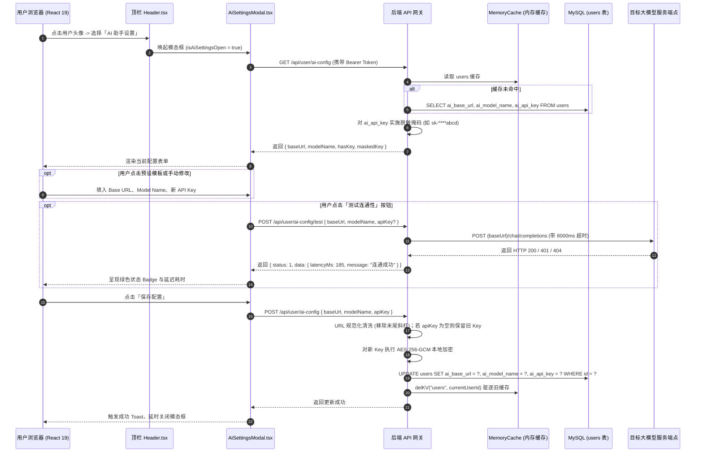

# 模块一：用户私有化 AI 配置与个人资料拓展 详细设计文档

> **文档定位**：拾光手记（DiarySystem）全功能自主思考日记 AI Agent 建设体系 —— 模块一详细设计与实施指南  
> **归属工程**：`Backend`（微内核服务） + `Frontend`（React 19 + Fluent UI v9 创作工作台）  
> **文档状态**：Ready for Implementation  
> **关联总纲**：[implementation_plan.md](file:///d:/Projects/DiarySystem/Doc/AI%20Agent/implementation_plan.md)

---

## 1. 模块定位与业务目标

### 1.1 需求背景
在知识管理与日记记录场景中，AI 模型的选型高度依赖用户的个性化偏好与隐私合规要求。部分用户偏好高推理能力的商业模型（如 DeepSeek-R1、OpenAI o1/gpt-4o），部分用户偏好高性价比的中转聚合 API，还有部分用户基于隐私安全倾向于接入本地局域网私有化模型（如通过 Ollama 或 vLLM 部署的开源大模型）。

因此，本模块作为整个 AI Agent 体系的**基础设施基石**，核心目标是为每个独立用户提供完全私有化的大模型接入端点配置，并提供直观、健壮的测试与管理界面。

### 1.2 核心业务目标
1. **任意兼容 OpenAI 规范端点接入**：支持主流大模型服务商、聚合中转以及本地私有模型；
2. **端到端敏感数据加密存储**：API Key 在数据库中密文存储，网络传输严格隔离，接口响应实施脱敏掩码，杜绝明文泄露风险；
3. **微内核自愈数据模式演进**：沿用后端无外部迁移工具的纯 Node.js 自愈体系，服务启动即自动完成数据表增量字段补齐；
4. **即时连通性探测探针**：在保存前或保存后均可发起真实网络连通测试，量化响应延迟（ms），提供友好的故障排查诊断；
5. **Fluent 2 顶级交互规范**：模态框支持常用模型一键预设填入、明暗密文切换、移动端与 PC 端自适应，完美融入系统现有的亚克力毛玻璃视觉体系。

---

## 2. 系统交互时序与数据流设计



---

## 3. 数据库模式演进与自愈设计（Database Schema Evolution）

紧密对齐系统现有 [`ensureSuperAdminAccount`](file:///d:/Projects/DiarySystem/Backend/src/core/admin/adminInit.ts#L15) 与 [`ensureUserAvatarColumn`](file:///d:/Projects/DiarySystem/Backend/src/core/admin/adminInit.ts#L89) 的自愈设计模式。

### 3.1 字段定义与约束
在 `users` 核心实体表中无损拓展 3 个字段：

| 字段名 | 类型 | 默认值 | 允许 NULL | 说明 |
| :--- | :--- | :--- | :---: | :--- |
| `ai_base_url` | `VARCHAR(512)` | `NULL` | 是 | 兼容 OpenAI 的 API Base URL，例如 `https://api.deepseek.com/v1` |
| `ai_model_name` | `VARCHAR(128)` | `NULL` | 是 | 默认调用的主模型名称，例如 `deepseek-reasoner`、`gpt-4o` |
| `ai_api_key` | `TEXT` | `NULL` | 是 | 使用系统主密钥 AES-256-GCM 加密存储的密文字符串 |

### 3.2 启动期自愈函数实现（`src/core/admin/ensureAiTables.ts`）
服务端启动流程中，通过 MySQL 的 `SHOW COLUMNS FROM users` 探测元数据，缺失字段即刻增量执行 DDL，不影响既有数据行：

```typescript
import { executeQuery, LogClient, returnError, returnSuccess, StandardResult } from "../index.js";

export async function ensureUserAiConfigColumns(): Promise<StandardResult<boolean>> {
  try {
    const checkSql = "SHOW COLUMNS FROM users;";
    const checkRes = await executeQuery<any>(checkSql);
    if (checkRes.status === 0 || !checkRes.data) {
      return returnError(`读取 users 表元数据失败: ${checkRes.content}`);
    }

    const existingColumns = new Set(checkRes.data.map((col: any) => col.Field));
    const missingStatements: string[] = [];

    if (!existingColumns.has("ai_base_url")) {
      missingStatements.push("ADD COLUMN ai_base_url VARCHAR(512) DEFAULT NULL");
    }
    if (!existingColumns.has("ai_model_name")) {
      missingStatements.push("ADD COLUMN ai_model_name VARCHAR(128) DEFAULT NULL");
    }
    if (!existingColumns.has("ai_api_key")) {
      missingStatements.push("ADD COLUMN ai_api_key TEXT DEFAULT NULL");
    }

    if (missingStatements.length > 0) {
      const alterSql = `ALTER TABLE users ${missingStatements.join(", ")};`;
      const alterRes = await executeQuery(alterSql);
      if (alterRes.status === 0) {
        return returnError(`自愈升级 users 表 AI 配置字段失败: ${alterRes.content}`);
      }
      LogClient.success(
        `🤖 users 表已自愈补充 AI 模型配置字段: [${missingStatements.join(", ")}]`,
        undefined,
        "AdminInit"
      );
    } else {
      LogClient.info("🤖 users 表 AI 配置字段校验完整，无需迁移", undefined, "AdminInit");
    }

    return returnSuccess(true);
  } catch (err: any) {
    return returnError(`自愈迁移 users.ai_* 字段异常: ${err.message || String(err)}`);
  }
}
```

### 3.3 启动链路挂载点（`Backend/src/index.ts`）
在 MySQL 连通性测试通过后，挂入自愈任务链：
```typescript
// Backend/src/index.ts 中
const aiColRes = await ensureUserAiConfigColumns();
if (aiColRes.status === 0) {
  LogClient.error(`AI 配置字段自愈核验失败: ${aiColRes.content}`, undefined, "DiaryBackend");
}
```

---

## 4. 后端加解密机制与安全隔离（Security & Crypto）

为了避免敏感的 API Key 在数据库备份、审计或日志排查中发生泄露，必须实行**密文落库 + 响应脱敏**机制。

### 4.1 AES-256-GCM 本地加密器（`src/core/crypto/cipher.ts`）
利用 Node.js 原生 `crypto` 模块，使用基于 `process.env.JWT_SECRET`（或派生密钥）的 `aes-256-gcm` 进行认证加密：
- **密文格式**：`hex(iv):hex(authTag):hex(encryptedContent)`；
- **自愈回退**：若解密失败（例如服务端 Secret 被重置），安全回退为空字符串或错误提示，避免抛出未捕获异常拖垮进程。

```typescript
import crypto from "crypto";

const ALGORITHM = "aes-256-gcm";
const IV_LENGTH = 12;

function getEncryptionKey(): Buffer {
  const secret = process.env.JWT_SECRET || "diary-system-default-key-32-chars-ok";
  return crypto.createHash("sha256").update(secret).digest();
}

export function encryptApiKey(plainText: string): string {
  if (!plainText) return "";
  const iv = crypto.randomBytes(IV_LENGTH);
  const key = getEncryptionKey();
  const cipher = crypto.createCipheriv(ALGORITHM, key, iv);
  
  let encrypted = cipher.update(plainText, "utf8", "hex");
  encrypted += cipher.final("hex");
  const authTag = cipher.getAuthTag().toString("hex");

  return `${iv.toString("hex")}:${authTag}:${encrypted}`;
}

export function decryptApiKey(cipherText: string): string {
  if (!cipherText || !cipherText.includes(":")) return "";
  try {
    const [ivHex, authTagHex, encrypted] = cipherText.split(":");
    if (!ivHex || !authTagHex || !encrypted) return "";

    const iv = Buffer.from(ivHex, "hex");
    const authTag = Buffer.from(authTagHex, "hex");
    const key = getEncryptionKey();
    const decipher = crypto.createDecipheriv(ALGORITHM, key, iv);
    decipher.setAuthTag(authTag);

    let decrypted = decipher.update(encrypted, "hex", "utf8");
    decrypted += decipher.final("utf8");
    return decrypted;
  } catch {
    return "";
  }
}
```

### 4.2 响应脱敏规则
当向前端下发当前配置时：
- 若未配置 Key，返回 `{ hasKey: false, maskedKey: "" }`；
- 若已配置 Key，仅保留前 3 位和后 4 位，其余替换为 `*`（例如 `sk-********************4f1a`），绝不向客户端下发明文 Key。

---

## 5. 后端 API 接口详细契约规范

全部端点挂载于 `src/api/user/ai-config/` 目录树下，由 `apiScanner` 自动预编译扫描。

### 5.1 获取用户 AI 配置
- **路由路径**：`GET /api/user/ai-config`
- **认证要求**：`authRequired: true`（必须携带有效的 Bearer Token）
- **处理逻辑**：
  1. 从 `ctx.userPayload.userId` 提取当前用户 ID；
  2. 查询 `SELECT ai_base_url, ai_model_name, ai_api_key FROM users WHERE id = ?`；
  3. 若数据库中存在加密的 `ai_api_key`，使用 `decryptApiKey` 解密后生成脱敏掩码；
  4. 返回当前 Base URL、模型名称、是否已设置密钥以及脱敏字符串。
- **响应体示例**：
  ```json
  {
    "status": 1,
    "content": "success",
    "data": {
      "baseUrl": "https://api.deepseek.com",
      "modelName": "deepseek-reasoner",
      "hasKey": true,
      "maskedKey": "sk-****7890"
    }
  }
  ```

---

### 5.2 更新用户 AI 配置
- **路由路径**：`POST /api/user/ai-config`
- **认证要求**：`authRequired: true`
- **请求体入参**：
  | 字段名 | 类型 | 必填 | 校验规则与说明 |
  | :--- | :--- | :---: | :--- |
  | `baseUrl` | string | 是 | 必须符合 URL 规范（必须以 `http://` 或 `https://` 开头），后端自动清除结尾的 `/` |
  | `modelName`| string | 是 | 模型名称不可为空字符串，长度限制 1~128 字符 |
  | `apiKey` | string | 否 | 若为空或未提供，则保留现有数据库中已配置的 Key；若提供了新值，则执行加密入库 |
- **处理管道**：
  1. 字段合法性初筛（校验 URL 格式与非空）；
  2. 自动规范化清洗：
     ```typescript
     let cleanBaseUrl = baseUrl.trim();
     while (cleanBaseUrl.endsWith("/")) {
       cleanBaseUrl = cleanBaseUrl.slice(0, -1);
     }
     ```
  3. API Key 处理策略：
     - 若入参提供了非空的 `apiKey.trim()`，调用 `encryptApiKey` 生成新密文；
     - 若入参未提供或为空白，SQL 更新语句跳过该列（保留原密文）；
  4. 执行 SQL `UPDATE users SET ai_base_url = ?, ai_model_name = ? ... WHERE id = ?`；
  5. 驱逐内存缓存 `delKV("users", userId)`；
  6. 返回更新后脱敏的最新配置结构体。
- **响应体示例**：
  ```json
  {
    "status": 1,
    "content": "AI 模型配置已保存",
    "data": {
      "baseUrl": "https://api.deepseek.com",
      "modelName": "deepseek-reasoner",
      "hasKey": true,
      "maskedKey": "sk-****abcd"
    }
  }
  ```

---

### 5.3 连通性实时测试探针
- **路由路径**：`POST /api/user/ai-config/test`
- **认证要求**：`authRequired: true`
- **设计目标**：无需强制先“保存配置”，允许用户填好参数后直接测试该组参数；若某项未传（如用户未改动 Key），则自动从数据库读取已有配置补齐。
- **请求体入参**：
  ```json
  {
    "baseUrl": "https://api.deepseek.com",
    "modelName": "deepseek-reasoner",
    "apiKey": "sk-new-key-or-empty"
  }
  ```
- **核心执行逻辑**：
  1. **参数补全**：若入参未传 `apiKey`，从当前用户数据库记录解密取出存量 Key；
  2. **端点拼接**：规范化 Base URL 后拼接 `/chat/completions`（若用户填写的已包含 `/chat/completions` 则不重复拼接）；
  3. **超轻量级 Ping Payload**：
     - 使用 `max_tokens: 1`（或 `5`）；
     - `messages: [{ role: "user", content: "ping" }]`；
     - 避免消耗用户多余 Token，仅用于探测服务可用性与鉴权有效性；
  4. **超时保护**：绑定 `AbortController`，最长超时设置为 8000ms；
  5. **记录起始时间戳**，计算响应延迟：`latencyMs = Date.now() - startTime`；
  6. **错误归类解析**：
     - HTTP 200：返回成功与耗时；
     - HTTP 401：准确提示“API 密钥无效或未授权 (401 Unauthorized)”；
     - HTTP 404：准确提示“目标模型不存在或路径错误 (404 Not Found)”；
     - 超时：提示“网络连接超时 (8s)，请检查 Base URL 是否可达或本地代理设置”。
- **响应体示例（成功）**：
  ```json
  {
    "status": 1,
    "content": "连接成功",
    "data": {
      "success": true,
      "latencyMs": 192,
      "model": "deepseek-reasoner",
      "message": "服务连通正常，响应延迟 192ms"
    }
  }
  ```
- **响应体示例（失败）**：
  ```json
  {
    "status": 0,
    "content": "连接失败: API 密钥无效 (401 Unauthorized)"
  }
  ```

---

## 6. 前端 Fluent 2 视觉与交互详细设计（`AiSettingsModal.tsx`）

### 6.1 预设服务商模板体系（Quick Presets）
在模态框顶部或表单上方，提供醒目的 Fluent 标签选择器，帮助用户一键填入常用服务商配置，降低手动配置门槛：

```typescript
export interface AiProviderPreset {
  id: string;
  name: string;
  icon: string;
  baseUrl: string;
  defaultModel: string;
  models: string[];
  placeholderKey: string;
}

export const AI_PRESETS: AiProviderPreset[] = [
  {
    id: "deepseek",
    name: "DeepSeek 官方",
    icon: "🐋",
    baseUrl: "https://api.deepseek.com",
    defaultModel: "deepseek-reasoner",
    models: ["deepseek-reasoner", "deepseek-chat"],
    placeholderKey: "sk-...",
  },
  {
    id: "openai",
    name: "OpenAI 官方",
    icon: "🟢",
    baseUrl: "https://api.openai.com/v1",
    defaultModel: "gpt-4o",
    models: ["gpt-4o", "gpt-4o-mini", "o1", "o3-mini"],
    placeholderKey: "sk-proj-...",
  },
  {
    id: "ollama",
    name: "本地 Ollama",
    icon: "🦙",
    baseUrl: "http://localhost:11434/v1",
    defaultModel: "qwen2.5:7b",
    models: ["qwen2.5:7b", "llama3.1:8b", "deepseek-r1:8b"],
    placeholderKey: "ollama (任意字符)",
  },
  {
    id: "qwen",
    name: "阿里通义千问",
    icon: "☁️",
    baseUrl: "https://dashscope.aliyuncs.com/compatible-mode/v1",
    defaultModel: "qwen-plus",
    models: ["qwen-plus", "qwen-max", "qwen-turbo"],
    placeholderKey: "sk-...",
  },
  {
    id: "moonshot",
    name: "月之暗面 Kimi",
    icon: "🌙",
    baseUrl: "https://api.moonshot.cn/v1",
    defaultModel: "moonshot-v1-8k",
    models: ["moonshot-v1-8k", "moonshot-v1-32k"],
    placeholderKey: "sk-...",
  },
];
```

用户点击对应芯片（Chip），自动同步填入 `baseUrl`，并在模型名称下方展示对应可选的快捷标签，点击即可填入 `modelName`。

---

### 6.2 界面视觉层次与 Fluent UI v9 映射

模态框整体基于现有通用动效 `useAppDialogMotion` 构建，支持 PC 端居中毛玻璃卡片（宽度 520px）与移动端触屏全屏模式：

```
+-------------------------------------------------------------+
|  🤖 AI 模型与智能引擎配置                            [ ✕ ]  |
+-------------------------------------------------------------+
|  请配置基于 OpenAI 协议标准的大模型接入参数，支持 DeepSeek、 |
|  OpenAI、本地 Ollama 等任意兼容端点。                       |
|                                                             |
|  [ 快速预设 ]                                               |
|  [ 🐋 DeepSeek ]  [ 🟢 OpenAI ]  [ 🦙 本地 Ollama ]  [ 更多 ]|
|                                                             |
|  API 基础地址 (Base URL) *                                  |
|  [ https://api.deepseek.com                              ]  |
|  提示: 兼容 OpenAI 格式的根路由，后端将自动拼接 /chat/completions |
|                                                             |
|  模型名称 (Model Name) *                                    |
|  [ deepseek-reasoner                                     ]  |
|  候选: [ deepseek-reasoner (推荐) ]  [ deepseek-chat ]      |
|                                                             |
|  API 密钥 (API Key)                                         |
|  [ •••••••••••••••••••••••••••••••••                 👁️ ]  |
|  当前状态: 已配置 (sk-****7890)。若无需更换，留空即可保持原密钥。 |
|                                                             |
|  +-------------------------------------------------------+  |
|  | [⚡ 测试连通性]   ✅ 连通测试通过 (延迟: 192ms)          |  |
|  +-------------------------------------------------------+  |
|                                                             |
+-------------------------------------------------------------+
|                                  [ 取消 ]    [ 保存配置 ]   |
+-------------------------------------------------------------+
```

#### Fluent UI v9 组件装配明细
- **外层容器**：`Dialog` + `DialogSurface`（使用现有 `surfaceMotion` 与 `backdropMotion`）；
- **标题头**：`DialogTitle` + 配合 `Dismiss20Regular` 关闭按钮；
- **表单区**：
  - `Field` + `Input`（配置 `contentBefore={<Globe20Regular />}` 图标修饰）；
  - Key 输入框配置 `contentAfter` 实现明文/密文切换（`Eye20Regular` / `EyeOff20Regular`）；
  - 模型快捷推荐：使用 Fluent `Tag` 或 `Badge` 组合；
- **操作区**：
  - 测试按钮：`Button appearance="subtle" icon={<PlugConnected20Regular />}`；
  - 保存按钮：`Button appearance="primary" icon={<Save20Regular />} style={{ backgroundColor: "#5B7B8D" }}`；
  - 动态状态：根据请求反馈展示 `Spinner` 或包含成功/警告信息的 Fluent `MessageBar`。

---

## 7. 现有代码修改与集成点明细

### 7.1 前端 API 客户端拓展（`Frontend/src/api/ai.ts`）
新建 `src/api/ai.ts`，封装对后端的 REST 请求：

```typescript
import { apiClient, ApiResponse } from "./client";

export interface UserAiConfig {
  baseUrl: string;
  modelName: string;
  hasKey: boolean;
  maskedKey: string;
}

export interface TestAiConfigResult {
  success: boolean;
  latencyMs?: number;
  model?: string;
  message: string;
}

export async function getAiConfig(): Promise<ApiResponse<UserAiConfig>> {
  return apiClient.get<UserAiConfig>("/api/user/ai-config");
}

export async function saveAiConfig(data: {
  baseUrl: string;
  modelName: string;
  apiKey?: string;
}): Promise<ApiResponse<UserAiConfig>> {
  return apiClient.post<UserAiConfig>("/api/user/ai-config", data);
}

export async function testAiConfig(data: {
  baseUrl: string;
  modelName: string;
  apiKey?: string;
}): Promise<ApiResponse<TestAiConfigResult>> {
  return apiClient.post<TestAiConfigResult>("/api/user/ai-config/test", data);
}
```

### 7.2 顶栏菜单集成（`Frontend/src/components/Header.tsx`）
在用户登录态下的头像下拉菜单中集成开关：
1. 引入图标：`import { Bot20Regular } from "@fluentui/react-icons";`
2. 新增状态控制：`const [isAiSettingsOpen, setIsAiSettingsOpen] = useState(false);`
3. 挂载菜单项：
   ```tsx
   <MenuItem
     icon={<Bot20Regular style={{ color: "#5B7B8D" }} />}
     onClick={() => setIsAiSettingsOpen(true)}
   >
     AI 助手设置
   </MenuItem>
   ```
4. 在组件底部同级渲染：
   ```tsx
   <AiSettingsModal
     isOpen={isAiSettingsOpen}
     onClose={() => setIsAiSettingsOpen(false)}
   />
   ```

---

## 8. 边界用例与异常处理规范

| 异常分类 | 场景描述 | 处理机制与用户反馈 |
| :--- | :--- | :--- |
| **入参格式异常** | Base URL 缺失协议头（如仅填 `api.deepseek.com`） | 前端即时提示并自动补全 `https://`，后端做严格正则验证 |
| **未修改 Key 场景** | 用户仅修改了 Model，Key 框保持原密文占位 | 提交时传空，后端执行保留原密文逻辑，绝不发生误清空覆盖 |
| **网络不可达** | 填写错误内网 IP 或被阻断地址 | 测试探针捕获 8s 超时，给出明确提示：“连接目标服务器超时，请核实地址与网络代理” |
| **模型权限受限** | 密钥无该模型访问权限或拼写错误 | 测试探针捕获 404/403，精准提示：“目标模型不存在或该 Key 无权访问” |
| **数据库并发锁** | 用户多次频繁点击保存 | 后端依赖连接池自动排他，更新后即刻驱逐 `MemoryCache` 避免脏读 |
| **移动端软键盘遮挡** | 手机端弹起输入法时弹窗被切断 | `DialogSurface` 开启自适应 `maxHeight: 90vh` 与纵向原生顺滑滚动 |

---

## 9. 模块交付物与验收标准

1. **自愈能力**：
   - 重启后端服务，终端打印 `users 表已自愈补充 AI 模型配置字段`，数据库无需手动迁移；
2. **安全性验证**：
   - 打开 MySQL 客户端执行 `SELECT ai_api_key FROM users`，确认字段呈现为 AES 密文形式，非明文；
   - 抓包审查 `GET /api/user/ai-config` 接口，确认仅返回 `sk-****` 脱敏掩码；
3. **连通性与配置闭环**：
   - 填写实际 DeepSeek/OpenAI 密钥并测试连通，确认返回正确的毫秒延迟；
   - 保存后刷新网页重新打开弹窗，原配置内容准确回显；
4. **视觉风格**：
   - 完全符合 Fluent UI 2 与 Win11 亚克力质感，深浅色切换视觉正常，移动端抽屉正常开启闭合。
