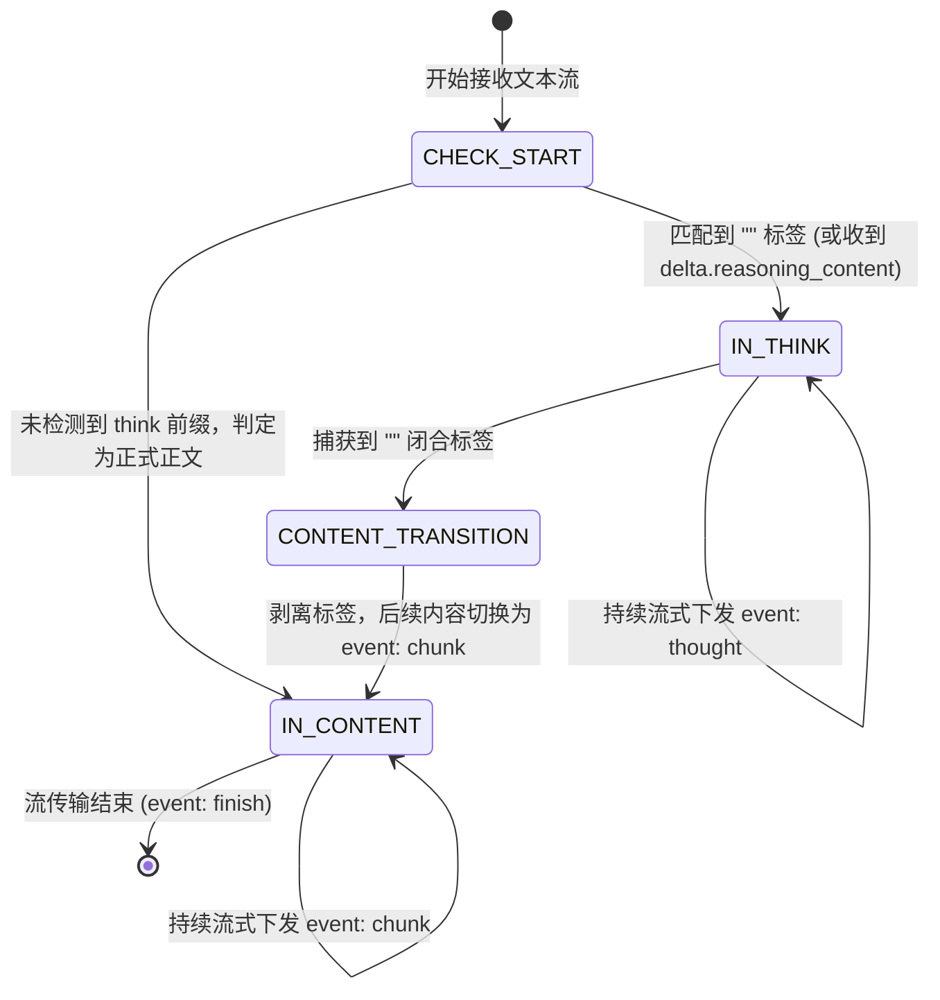
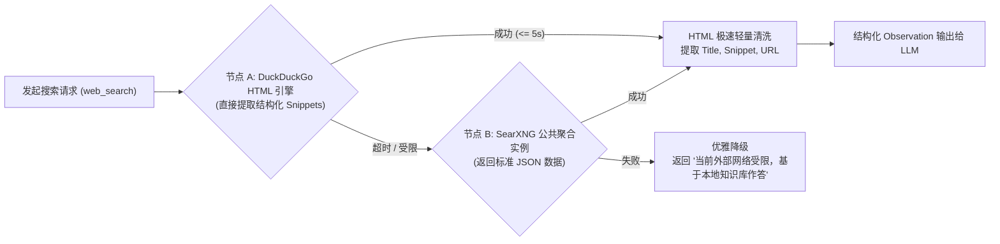

# 模块三：自主思考与实时网络探索引擎（ReAct & Web Search）详细设计文档

> **文档定位**：拾光手记（DiarySystem）全功能自主思考日记 AI Agent 建设体系 —— 模块三详细设计与实施指南  
> **归属工程**：`Backend`（微内核服务 `src/core/agent/`）  
> **文档状态**：Ready for Implementation  
> **关联总纲**：[implementation_plan.md](file:///d:/Projects/DiarySystem/Doc/AI%20Agent/implementation_plan.md)

---

## 1. 模块定位与核心设计哲学

### 1.1 需求背景
在大语言模型落地于个人知识库与日记伴侣的场景中，用户输入的问题往往呈现高度的不确定性与复合性：
1. **多步骤复合分析**：用户提问“帮我对比今年夏天和去年夏天的心情，并结合当时的天气看看有什么规律”。这无法通过单次请求直接回答，模型必须先检索两个不同时间段的日记与天气数据，再进行统计与归纳；
2. **深度推理与思维链显性化**：以 DeepSeek-R1、OpenAI o1/o3-mini 为代表的推理模型，在给出答案前拥有数百至数千 token 的思考推演过程（Chain of Thought, CoT）。用户期望实时直观地观察到 AI 的“心路历程”，建立信任感；
3. **外部实时知识拓展**：当用户询问日记中涉及的外部现实（如“日记里提到今天去看了某部新上映的电影，外界评分如何？”、“明天西湖天气如何，适合我出门拍照吗？”），Agent 必须打破本地私有知识的孤岛，自主联网获取实时客观信源。

因此，**模块三是整个 AI Agent 的“大脑中枢与探索雷达”**。它负责协调思维链提取、ReAct 多轮自主决策闭环、以及免 API Key 的高可用网页检索。

---

## 2. 系统拓扑与 ReAct 决策时序图

### 2.1 ReAct 多轮循环与思维链分流架构

```mermaid
flowchart TB
    subgraph Client["前端客户端 (Web/Mobile)"]
        UI_Thought["ThoughtAccordion (流光思考折叠卡片)"]
        UI_Tool["ToolCallBadge (工具调用过程卡片)"]
        UI_Markdown["TypewriterMarkdown (正文渐变打字机)"]
    end

    subgraph SSE_Gateway["SSE 流式分发通道 (/api/ai/chat)"]
        EV_Thought["event: thought (增量推思考)"]
        EV_ToolStart["event: tool_call (工具开始)"]
        EV_ToolEnd["event: tool_result (工具返回)"]
        EV_Chunk["event: chunk (增量推正文)"]
    end

    subgraph ReActEngine["ReAct 决策调度中枢 (agentEngine.ts)"]
        LoopController["ReAct 循环控制器<br/>(最大 6 轮迭代 / 死循环熔断)"]
        StreamParser["思维链分流状态机 (streamParser.ts)<br/>• 原生 reasoning_content 解析<br/>• 文本 &lt;think&gt; 标签动态剥离"]
        PromptBuilder["PromptTemplates (动态注入当前时间/身份/元规则)"]
    end

    subgraph ToolCenter["工具分发与网络引擎"]
        Registry["AgentToolRegistry (工具注册中心)"]
        DiaryTools["Diary Toolset (模块二 7 大日记工具)"]
        WebTool["web_search (实时网络探索 - webSearchTool.ts)"]
    end

    subgraph External["外部生态"]
        LLM["用户配置的 OpenAI 兼容端点"]
        SearchEngines["公共免 Key 搜索引擎集群<br/>(DuckDuckGo / SearXNG 备用路由)"]
    end

    ReActEngine <-->|Chat Completions (Stream)| LLM
    StreamParser --> EV_Thought
    StreamParser --> EV_Chunk
    LoopController --> EV_ToolStart
    LoopController --> EV_ToolEnd
    EV_Thought --> UI_Thought
    EV_ToolStart --> UI_Tool
    EV_ToolEnd --> UI_Tool
    EV_Chunk --> UI_Markdown

    LoopController --> Registry
    Registry --> DiaryTools
    Registry --> WebTool
    WebTool <-->|HTTP / 超时重试| SearchEngines
```

---

## 3. 思维链捕获与流式分流状态机（Thinking Stream Parser）

### 3.1 双通道兼容机制
不同厂商的大模型在输出思考过程时采用不同的规范：
- **通道 A：标准协议级推理字段（Protocol-level `reasoning_content`）**  
  以 DeepSeek 官方 API、vLLM、Ollama 高版本为代表，在流式 SSE chunk 的 `delta` 中独立携带 `delta.reasoning_content`。
- **通道 B：正文标签级推理内容（Tag-level `<think>...</think>`）**  
  部分本地微调开源模型（如 QwQ、直接运行的 GGUF 格式模型）在 `delta.content` 中直接输出 `<think>思考内容</think>正式回复`。

### 3.2 增量流式状态机设计（`streamParser.ts`）
为了杜绝 `<think>` 和 `</think>` 标签本身被泄漏到前端正文中，并且确保“思考流”与“正文流”能够以不同的 SSE 事件下发，自研**字符级滑动窗口流式状态机**：



#### 状态机核心算法实现细节
```typescript
// Backend/src/core/agent/streamParser.ts

export type StreamMode = "CHECKING" | "THINKING" | "CONTENT";

export class ThinkingStreamParser {
  private mode: StreamMode = "CHECKING";
  private buffer: string = "";
  private onThoughtChunk: (chunk: string) => void;
  private onContentChunk: (chunk: string) => void;

  constructor(callbacks: {
    onThoughtChunk: (chunk: string) => void;
    onContentChunk: (chunk: string) => void;
  }) {
    this.onThoughtChunk = callbacks.onThoughtChunk;
    this.onContentChunk = callbacks.onContentChunk;
  }

  /**
   * 优先处理协议级原生 reasoning_content
   */
  public feedReasoningDelta(delta: string) {
    if (delta) {
      this.onThoughtChunk(delta);
    }
  }

  /**
   * 核心处理 content delta，剥离可能存在的 <think>...</think> 文本标签
   */
  public feedContentDelta(delta: string) {
    if (!delta) return;

    if (this.mode === "CONTENT") {
      this.onContentChunk(delta);
      return;
    }

    this.buffer += delta;

    if (this.mode === "CHECKING") {
      // 探测前缀是否以 <think> 开头 (容忍前置换行与空格)
      const trimmed = this.buffer.trimStart();
      if ("<think>".startsWith(trimmed)) {
        // 处于 <think> 标签的中间分块接收态，继续缓冲
        if (trimmed === "<think>") {
          this.mode = "THINKING";
          this.buffer = "";
        }
        return;
      }

      if (this.buffer.includes("<think>")) {
        const parts = this.buffer.split("<think>");
        if (parts[0]) this.onContentChunk(parts[0]);
        this.mode = "THINKING";
        this.buffer = parts[1] || "";
      } else {
        // 无 <think> 标签，直接切换为纯正文模式
        this.mode = "CONTENT";
        this.onContentChunk(this.buffer);
        this.buffer = "";
        return;
      }
    }

    if (this.mode === "THINKING") {
      if (this.buffer.includes("</think>")) {
        const [thinkText, remaining] = this.buffer.split("</think>");
        if (thinkText) this.onThoughtChunk(thinkText);
        this.mode = "CONTENT";
        this.buffer = "";
        if (remaining) {
          // 清除多余的首尾空行后作为正式正文推送
          this.onContentChunk(remaining.replace(/^\s+/, ""));
        }
      } else {
        // 预留最后几个字符防范 </think> 被跨分块截断
        if (this.buffer.length > 8) {
          const emitLength = this.buffer.length - 8;
          const toEmit = this.buffer.slice(0, emitLength);
          this.buffer = this.buffer.slice(emitLength);
          this.onThoughtChunk(toEmit);
        }
      }
    }
  }

  /**
   * 流结束时排空剩余缓冲
   */
  public flush() {
    if (this.buffer) {
      if (this.mode === "THINKING") {
        this.onThoughtChunk(this.buffer);
      } else {
        this.onContentChunk(this.buffer);
      }
      this.buffer = "";
    }
  }
}
```

---

## 4. ReAct 多轮自主决策循环调度引擎（`agentEngine.ts`）

### 4.1 核心循环流控算法
ReAct 引擎作为自主执行的中枢，承载大模型多轮思考与工具执行的生命周期：

1. **上下文组装**：
   - 注入动态 System Prompt（包含用户昵称、**当前系统标准时间**、角色使命与安全红线）；
   - 装载历史对话上下文（支持滑动窗口截断，避免超出上下文上限）；
   - 装载全套可用工具定义（模块二的 7 大日记工具 + 模块三的 `web_search`）。
2. **单次轮次调用与流式分块累加**：
   - 发起 `POST {baseUrl}/chat/completions` 流式请求（`stream: true`）；
   - 在流接收过程中：
     - 若收到 `reasoning_content`，送入 `feedReasoningDelta` 推送 `thought` 事件；
     - 若收到普通正文，送入 `feedContentDelta`；
     - 若收到 `tool_calls` 的分块参数片段（`delta.tool_calls`），在内存中动态拼接组装：
       ```typescript
       // 工具增量流式参数累加
       for (const tc of delta.tool_calls) {
         const idx = tc.index ?? 0;
         if (!accumulatedToolCalls[idx]) {
           accumulatedToolCalls[idx] = {
             id: tc.id || `call_${Date.now()}_${idx}`,
             type: "function",
             function: { name: tc.function?.name || "", arguments: "" },
           };
         }
         if (tc.function?.name) accumulatedToolCalls[idx].function.name += tc.function.name;
         if (tc.function?.arguments) accumulatedToolCalls[idx].function.arguments += tc.function.arguments;
       }
       ```
3. **决策分流点**：
   - **分支 A：模型下发了 `tool_calls`**
     - 暂停正文下发；
     - 向客户端下发 `event: tool_call`，携带工具名称与格式化入参；
     - 调度 `ToolRegistry.executeTool(name, args, context)` 执行工具；
     - 工具执行完成，向客户端下发 `event: tool_result`，包含执行摘要（如 `已定位到 2 处日记片段`）；
     - 将工具的返回内容构造成标准 tool 消息，推入本轮消息上下文：
       ```json
       {
         "role": "tool",
         "tool_call_id": "call_123",
         "content": "{\"totalMatches\": 2, \"diaries\": [...]}"
       }
       ```
     - 迭代计数器 `iteration++`。若 `iteration <= MAX_ITERATIONS (6)`，**自动递归触发下一轮模型请求**；
   - **分支 B：模型未调用工具（输出纯文本回复）**
     - 流式正文输出完毕，触发 `event: finish`，结束循环。
4. **死循环与异常熔断保护**：
   - **最大轮次截断**：单次用户提问最多允许 6 轮工具调用迭代。若达到 6 轮模型依然尝试调用工具，强行切断并注入系统提示：“*（系统提示：已达到最大分析轮次，请根据当前已知的所有检索结果给出最终总结和回复）*”，强制模型收尾；
   - **客户端中止（Abort）**：绑定 HTTP 请求的 `req.on('close')`，一旦用户在界面点击“停止生成”或关闭标签页，立即调用 `AbortController.abort()`，阻断后续所有工具调用与大模型网络请求。

---

## 5. 实时网络搜索工具详细设计（`webSearchTool.ts`）

### 5.1 工具定位与触发场景
- **触发场景**：
  1. 用户提问包含明确的外部时事（如“今天有什么重大科技新闻？”、“某某电视剧完结了吗？”）；
  2. 询问外部天气、旅行交通或景点信息（如“明天上海的天气预报”、“去黄山旅游有什么推荐路线？”）；
  3. 寻求技术标准或客观知识（如“React 19 的新特性有哪些？”、“Node.js 官方推荐的加密算法”）。
- **工具契约（JSON Schema）**：
  ```json
  {
    "name": "web_search",
    "description": "进行实时互联网网页搜索。当用户询问外部世界实时资讯、客观知识、天气预报、最新技术或旅行生活攻略时调用此工具。",
    "parameters": {
      "type": "object",
      "properties": {
        "query": {
          "type": "string",
          "description": "精炼的搜索查询词。避免自然语言长句，提取关键词组合（如 '杭州 明天 天气' 或 'Node.js LTS 最新版本'）"
        },
        "maxResults": {
          "type": "integer",
          "description": "期望获取的网页结果数量，默认 5 条，范围 1~8"
        }
      },
      "required": ["query"]
    }
  }
  ```

---

### 5.2 免 API Key 聚合搜索网络探测管道

为确保开箱即用，无需用户额外申请 Bing/Google 付费 Search API，后端构建**高可用免 Key 搜索管道**：



#### 管道核心实现算法
```typescript
// Backend/src/core/agent/tools/webSearchTool.ts

import { AgentToolDefinition, AgentToolExecutor, AgentToolResult } from "./types.js";

export interface SearchResultItem {
  title: string;
  url: string;
  snippet: string;
}

export const webSearchTool: AgentToolDefinition = {
  type: "function",
  function: {
    name: "web_search",
    description: "进行实时互联网网页搜索。用于检索最新外部资讯、时事、技术资料、天气与百科知识。",
    parameters: {
      type: "object",
      properties: {
        query: {
          type: "string",
          description: "搜索关键词（提炼核心短语）",
        },
        maxResults: {
          type: "integer",
          description: "返回结果数，默认 5 条",
        },
      },
      required: ["query"],
    },
  },
};

export const webSearchExecutor: AgentToolExecutor = async (args, context): Promise<AgentToolResult> => {
  const query = (args?.query || "").trim();
  const maxResults = Math.min(Math.max(args?.maxResults || 5, 1), 8);

  if (!query) {
    return {
      success: false,
      error: "搜索关键词不能为空",
      summary: "搜索失败：缺少关键词",
    };
  }

  const controller = new AbortController();
  const timeoutId = setTimeout(() => controller.abort(), 6000); // 6秒超时

  try {
    // 方案 A：通过 DuckDuckGo HTML 抓取
    const searchUrl = `https://html.duckduckgo.com/html/?q=${encodeURIComponent(query)}`;
    const resp = await fetch(searchUrl, {
      signal: controller.signal,
      headers: {
        "User-Agent": "Mozilla/5.0 (Windows NT 10.0; Win64; x64) AppleWebKit/537.36 (KHTML, like Gecko) Chrome/124.0.0.0 Safari/537.36",
        "Accept-Language": "zh-CN,zh;q=0.9,en;q=0.8",
      },
    });
    clearTimeout(timeoutId);

    if (resp.ok) {
      const html = await resp.text();
      const items = parseDuckDuckGoHtml(html, maxResults);
      if (items.length > 0) {
        return {
          success: true,
          data: {
            query,
            total: items.length,
            results: items,
          },
          summary: `已联网检索到 ${items.length} 条关于 "${query}" 的最新网页`,
        };
      }
    }
  } catch (err: any) {
    clearTimeout(timeoutId);
  }

  // 方案 B：平滑降级，不阻断 Agent 整体回复
  return {
    success: true,
    data: {
      query,
      total: 0,
      results: [],
      notice: "当前外部网络环境受限或搜索引擎未返回有效结果。请根据您掌握的知识或用户日记记录作答，并向用户说明无法获取实时最新网页。",
    },
    summary: `网络搜索 "${query}" 暂无结果，将结合已有知识作答`,
  };
};

/**
 * 极简、安全的 HTML 提取器，不依赖臃肿的 cheerio 或 jsdom
 */
function parseDuckDuckGoHtml(html: string, limit: number): SearchResultItem[] {
  const results: SearchResultItem[] = [];
  const resultRegex = /<a class="result__url" href="([^"]+)">[\s\S]*?<h2 class="result__title">[\s\S]*?<a class="result__a"[^>]*>([\s\S]*?)<\/a>[\s\S]*?<a class="result__snippet"[^>]*>([\s\S]*?)<\/a>/g;
  
  // 简易正则清洗标签
  const stripTags = (s: string) => s.replace(/<[^>]+>/g, "").replace(/&quot;/g, '"').replace(/&amp;/g, '&').replace(/&lt;/g, '<').replace(/&gt;/g, '>').trim();

  let match: RegExpExecArray | null;
  while ((match = resultRegex.exec(html)) !== null && results.length < limit) {
    const rawUrl = match[1];
    const title = stripTags(match[2]);
    const snippet = stripTags(match[3]);

    // 解码 DuckDuckGo 真实跳转 URL
    let realUrl = rawUrl;
    if (rawUrl.includes("uddg=")) {
      const u = new URL("https://duckduckgo.com" + rawUrl).searchParams.get("uddg");
      if (u) realUrl = decodeURIComponent(u);
    }

    if (title && snippet) {
      results.push({ title, url: realUrl, snippet });
    }
  }

  return results;
}
```

### 5.3 真实信源标注规范（Anti-Hallucination Guardrail）
在返回的 Observation 中规范输出格式，并通过 System Prompt 约束大模型：
- 当回答中引用了 `web_search` 的信息时，**必须**在正文使用 Markdown 超链接形式给出明确信源出处（如 `根据 [微软官方文档](https://...) 说明` 或在末尾附带 `### 参考来源` 列表）；
- 严禁捏造虚假 URL。

---

## 6. 系统提示词体系与元规则设计（`promptTemplates.ts`）

提示词工程是大模型能否精准调用工具、保持安全隐私与理性思考的核心契约。

```typescript
// Backend/src/core/agent/promptTemplates.ts

export function buildSystemPrompt(user: { nickname?: string; username: string }): string {
  const now = new Date();
  const dateStr = now.toLocaleDateString("zh-CN", {
    year: "numeric",
    month: "2-digit",
    day: "2-digit",
    weekday: "long",
  });
  const timeStr = now.toLocaleTimeString("zh-CN", { hour12: false });

  return `你叫「拾光手记 AI 助手」，是「拾光手记（DiarySystem）」私有化系统的专属全功能智能伙伴。
当前对话用户：${user.nickname || user.username} (@${user.username})
当前现实标准时间：${dateStr} ${timeStr}

【核心使命与定位】
1. 你具备自主规划、深度思考（Chain of Thought）与多步工具调用的全套能力。
2. 你的职责是帮助用户探索日记记忆、分析情感与生活轨迹、辅助写作润色，并在需要时通过实时互联网检索提供前沿客观信息。

【工具使用原则与纪律】
1. **私有知识优先与真实性红线**：当用户询问自己过去的日记、事件、哪天做了什么、心情走势时，严禁凭借想象捏造！必须优先调用日记工具（search_diaries, locate_diary_content, get_diary_timeline_stats 等）获取真实记录后再作答。
2. **段落级精细回忆**：若用户寻找具体某件事发生在何时或具体细节，优先使用 locate_diary_content 工具，精确定位段落行号与上下文。
3. **外部时效性联网**：当用户询问外部客观世界时事、最新新闻、实时天气预报、百科常识或技术文档时，自主调用 web_search 获取权威信息，并在回答中以 Markdown 链接形式标明信源出处。
4. **安全防误删红线**：delete_diary 是不可逆的破坏性操作。除非用户在对话中明确表态确认删除，否则严禁擅自执行；在调用删除前必须向用户确认。
5. **起草与更新**：若用户指令要求“帮我记一篇日记”或“给某篇日记加上总结”，直接调用 create_diary 或 update_diary 协助完成，并告知用户已成功保存。

【输出排版规范】
- 逻辑清晰，善于使用清晰的小标题、列表、加粗强调；
- 涉及数学公式时规范输出 LaTeX 语法（行内 $...$，块级 $$...$$）；
- 涉及代码或架构图时规范输出代码块（包括 \`\`\`mermaid 矢量图表）；
- 语气应当温和、睿智、充满同理心与启发性。`;
}
```

---

## 7. 文件新建与代码集成清单

| 序号 | 目标文件路径 | 变更属性 | 主要技术职责 |
| :---: | :--- | :---: | :--- |
| 1 | `Backend/src/core/agent/streamParser.ts` | **新建** | 实现思维链分流状态机（剥离 `<think>` 标签，解耦 `thought` 与 `chunk`） |
| 2 | `Backend/src/core/agent/promptTemplates.ts`| **新建** | 构建动态注入当前时间、身份、工具纪律与安全红线的 System Prompt 模板 |
| 3 | `Backend/src/core/agent/tools/webSearchTool.ts`| **新建** | 实现基于 DuckDuckGo HTML / SearXNG 的高可用免 Key 网页搜索与清洗工具 |
| 4 | `Backend/src/core/agent/tools/index.ts` | **修改** | 将 `web_search` 工具注册进统一的 `ToolRegistry` |
| 5 | `Backend/src/core/agent/agentEngine.ts` | **新建** | 实现自主思考 ReAct 循环调度引擎，负责与 OpenAI 兼容端点通信、函数调用循环、流式解析与思维链提取 |
| 6 | `Backend/src/core/index.ts` | **修改** | 统一对外导出 `agentEngine`、`buildSystemPrompt` 与相关类型定义 |

---

## 8. 验证用例与验收标准

| 测试场景 | 模拟用户输入 | 预期 Agent 行为与时序链路 | 验收标准 |
| :--- | :--- | :--- | :--- |
| **深度推理思维链展示** | “比较一下快速排序和归并排序在链表排序中的优劣” | 收到 R1 或 o1 推理流，通过 `event: thought` 实时推送思考过程 | 前端折叠卡片展示打字效果，正文没有残留 `<think>` 标签 |
| **多轮工具自主规划** | “帮我看看上周五我心情怎么样，写过什么日记，并查查那天的热点新闻” | **轮次 1**：调用 `search_diaries` 获取上周五日记；<br/>**轮次 2**：调用 `web_search` 检索当日新闻；<br/>**轮次 3**：综合两者输出深度回复 | 触发 2 轮独立工具调用，正确串联私有日记与外部网络结果 |
| **实时网络搜索与信源** | “现在 Node.js 最新的 LTS 版本是哪个？” | 触发 `web_search(query: "Node.js latest LTS version")` | 成功输出版本号，末尾附带 `https://nodejs.org` 来源链接 |
| **熔断与防死循环保护** | 构造复杂歧义提问引发模型持续调用工具 | 引擎在达到第 6 轮时自动截断工具调用并注入收敛提示 | 保证在 6 轮内优雅输出最终答复，连接正常关闭 |
| **用户主动中止响应** | 在长文本生成或工具执行中途点击“停止” | 触发 `req.on('close')` -> `controller.abort()` | 后端立即终止后续 LLM 调用与网络请求，无孤儿进程 |
