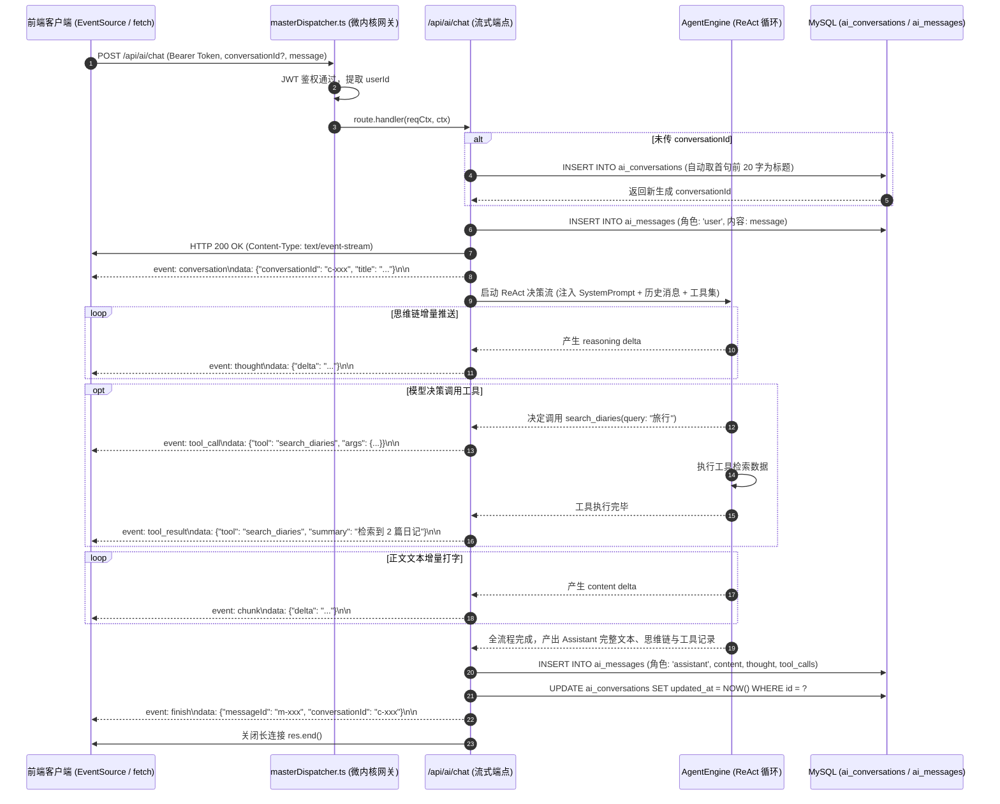

# 模块四：微内核 SSE 流式网关与会话持久化 详细设计文档

> **文档定位**：拾光手记（DiarySystem）全功能自主思考日记 AI Agent 建设体系 —— 模块四详细设计与实施指南  
> **归属工程**：`Backend`（网关层 `src/dispatcher/` + API 契约层 `src/api/ai/` + 存储自愈 `src/core/agent/`）  
> **文档状态**：Ready for Implementation  
> **关联总纲**：[implementation_plan.md](file:///d:/Projects/DiarySystem/Doc/AI%20Agent/implementation_plan.md)

---

## 1. 模块定位与业务目标

### 1.1 需求背景
大语言模型生成长文本、展开思维链推演以及调用工具检索信息，通常需要持续数秒至数十秒。传统的单次 HTTP 请求-响应模式（Request-Response）会导致客户端长时间陷入空白 Loading 状态，无法满足现代化 AI 聊天界面的即时反馈体验。

本模块的核心职责是在**脱离任何外部重量级 Web 框架的前提下，基于 Node.js 原生 `node:http` 实现高并发、低延迟的 Server-Sent Events（SSE）流式推送传输管道**，同时建立一套高可靠的**会话与消息生命周期持久化系统**。

### 1.2 核心设计目标
1. **原生微内核 SSE 协议适配**：兼容现有 `masterDispatcher` 管道，通过分块传输编码（`Transfer-Encoding: chunked`）实现毫秒级增量事件推送；
2. **细粒度标准化事件矩阵**：通过清晰定义的 Event 类型（`conversation`、`thought`、`tool_call`、`tool_result`、`chunk`、`finish`、`error`），使前端能够精准捕获思考链、工具卡片与正文内容；
3. **数据库启动自愈建表**：自动检测并创建 `ai_conversations`（会话树）与 `ai_messages`（消息历史）表，建立多维度高性能索引；
4. **会话完整生命周期管理（CRUD）**：支持会话列表分页、置顶/取消置顶、智能标题自动提取、重命名与软删除；
5. **断连即时熔断与防资源泄漏**：监听底层 Socket `close` 事件，一旦用户关闭网页或中止响应，即刻中断大模型与网络工具链路。

---

## 2. 系统拓扑与 SSE 流式数据时序



---

## 3. 原生 `node:http` 的 SSE 流式网关改造设计

### 3.1 `masterDispatcher.ts` 的流式向后兼容改造
当前项目的 [`masterDispatcher.ts`](file:///d:/Projects/DiarySystem/Backend/src/dispatcher/masterDispatcher.ts#L181-L204) 将所有路由结果默认视作普通的 JSON 对象，并通过 `sendJsonResponse(res, handlerRes, 200)` 一次性输出。

为支持流式长连接，改造逻辑遵循**零侵入、零破坏既有接口**原则：
1. **暴露原生 `res` 对象**：在构建 `reqCtx` 时挂载原生 HTTP ServerResponse 对象：
   ```typescript
   const reqCtx = {
     req,
     res, // [NEW] 允许流式接口接管底层响应流
     query,
     body,
     files,
     clientIp,
     params: query,
     user: userPayload,
   };
   ```
2. **`res.headersSent` 守卫判定**：
   在执行完 `route.handler` 后，检查 `res.headersSent` 是否为 `true`：
   ```typescript
   const handlerRes = await route.handler(reqCtx, ctx);

   // 若响应头已被 Handler 接管下发 (如 SSE 流式传输)，网关不重复发送 JSON 响应
   if (res.headersSent) {
     await releaseMemoryLocks(lockedRows, true);
     recordAccessLog(req.method || "GET", pathname, 200, clientIp, Date.now() - startTime, currentUserId);
     return;
   }
   ```
   如此改动后，常规 REST 接口维持原有行为，流式接口可自由向 `res` 写入分块数据。

---

### 3.2 SSE 工具辅助类封装（`src/utils/sseHelper.ts`）
为了规范化事件写入并提供心跳保活机制，在 `src/utils/sseHelper.ts` 中封装流式控制器：

```typescript
// Backend/src/utils/sseHelper.ts

import http from "http";

export class SseStreamController {
  private res: http.ServerResponse;
  private req: http.IncomingMessage;
  private pingTimer: NodeJS.Timeout | null = null;
  private isClosed: boolean = false;
  private abortController: AbortController = new AbortController();

  constructor(req: http.IncomingMessage, res: http.ServerResponse) {
    this.req = req;
    this.res = res;

    // 1. 设置标准 SSE 响应头
    this.res.writeHead(200, {
      "Content-Type": "text/event-stream; charset=utf-8",
      "Cache-Control": "no-cache, no-transform",
      "Connection": "keep-alive",
      "X-Accel-Buffering": "no", // 禁用 Nginx 缓冲
      "Access-Control-Allow-Origin": "*",
      "Access-Control-Allow-Headers": "Content-Type, Authorization",
    });

    // 2. 启用 TCP Keep-Alive
    this.req.socket.setKeepAlive(true);

    // 3. 监听客户端断开连接
    this.req.on("close", () => {
      this.isClosed = true;
      this.abortController.abort();
      this.cleanUp();
    });

    // 4. 定期发送注释心跳保活帧 (每 15 秒)，防止代理服务器超时断连
    this.pingTimer = setInterval(() => {
      if (!this.isClosed && !this.res.writableEnded) {
        this.res.write(": ping\n\n");
      }
    }, 15000);
  }

  public get signal(): AbortSignal {
    return this.abortController.signal;
  }

  public get closed(): boolean {
    return this.isClosed || this.res.writableEnded;
  }

  /**
   * 推送标准 SSE 事件
   */
  public sendEvent(eventName: string, data: any) {
    if (this.closed) return;
    const payload = typeof data === "string" ? data : JSON.stringify(data);
    this.res.write(`event: ${eventName}\ndata: ${payload}\n\n`);
  }

  /**
   * 结束流连接
   */
  public finish(data?: any) {
    if (this.closed) return;
    if (data) {
      this.sendEvent("finish", data);
    }
    this.cleanUp();
    this.res.end();
  }

  /**
   * 下发错误并关闭流
   */
  public error(errorMsg: string) {
    if (this.closed) return;
    this.sendEvent("error", { error: errorMsg });
    this.cleanUp();
    this.res.end();
  }

  private cleanUp() {
    if (this.pingTimer) {
      clearInterval(this.pingTimer);
      this.pingTimer = null;
    }
  }
}
```

---

## 4. 会话持久化数据表与启动自愈设计

紧跟微内核模式，新建自愈模块 `src/core/agent/ensureAiTables.ts`，由 `src/index.ts` 在系统初始化启动时自动调用。

### 4.1 数据表 DDL 规划

#### 1. `ai_conversations`（对话会话表）
```sql
CREATE TABLE IF NOT EXISTS ai_conversations (
  id VARCHAR(64) PRIMARY KEY,
  user_id VARCHAR(64) NOT NULL,
  title VARCHAR(255) NOT NULL DEFAULT '新建手记对话',
  is_pinned TINYINT(1) NOT NULL DEFAULT 0 COMMENT '是否置顶',
  created_at DATETIME NOT NULL DEFAULT CURRENT_TIMESTAMP,
  updated_at DATETIME NOT NULL DEFAULT CURRENT_TIMESTAMP ON UPDATE CURRENT_TIMESTAMP,
  deleted_at DATETIME NULL COMMENT '软删除标记',
  INDEX idx_user_list (user_id, deleted_at, is_pinned DESC, updated_at DESC)
) ENGINE=InnoDB DEFAULT CHARSET=utf8mb4 COLLATE=utf8mb4_unicode_ci;
```

#### 2. `ai_messages`（对话消息明细表）
```sql
CREATE TABLE IF NOT EXISTS ai_messages (
  id VARCHAR(64) PRIMARY KEY,
  conversation_id VARCHAR(64) NOT NULL,
  user_id VARCHAR(64) NOT NULL,
  role ENUM('user', 'assistant', 'system', 'tool') NOT NULL,
  content LONGTEXT NOT NULL COMMENT '正文内容',
  thought LONGTEXT NULL COMMENT '思维链过程 (<think>) 内容',
  tool_calls JSON NULL COMMENT '模型调用的工具及参数记录',
  tool_call_id VARCHAR(128) NULL COMMENT '工具回调映射 ID',
  created_at DATETIME NOT NULL DEFAULT CURRENT_TIMESTAMP,
  INDEX idx_conv_timeline (conversation_id, created_at ASC),
  INDEX idx_user_audit (user_id, created_at DESC)
) ENGINE=InnoDB DEFAULT CHARSET=utf8mb4 COLLATE=utf8mb4_unicode_ci;
```

### 4.2 自愈初始化函数（`ensureAiTables.ts`）
```typescript
// Backend/src/core/agent/ensureAiTables.ts

import { executeQuery, LogClient, returnError, returnSuccess, StandardResult } from "../index.js";

export async function ensureAiConversationTables(): Promise<StandardResult<boolean>> {
  try {
    // 1. 自愈建表 ai_conversations
    const createConvSql = `
      CREATE TABLE IF NOT EXISTS ai_conversations (
        id VARCHAR(64) PRIMARY KEY,
        user_id VARCHAR(64) NOT NULL,
        title VARCHAR(255) NOT NULL DEFAULT '新建手记对话',
        is_pinned TINYINT(1) NOT NULL DEFAULT 0,
        created_at DATETIME NOT NULL DEFAULT CURRENT_TIMESTAMP,
        updated_at DATETIME NOT NULL DEFAULT CURRENT_TIMESTAMP ON UPDATE CURRENT_TIMESTAMP,
        deleted_at DATETIME NULL,
        INDEX idx_user_list (user_id, deleted_at, is_pinned DESC, updated_at DESC)
      ) ENGINE=InnoDB DEFAULT CHARSET=utf8mb4 COLLATE=utf8mb4_unicode_ci;
    `;
    const resConv = await executeQuery(createConvSql);
    if (resConv.status === 0) return returnError(`创建 ai_conversations 失败: ${resConv.content}`);

    // 2. 自愈建表 ai_messages
    const createMsgSql = `
      CREATE TABLE IF NOT EXISTS ai_messages (
        id VARCHAR(64) PRIMARY KEY,
        conversation_id VARCHAR(64) NOT NULL,
        user_id VARCHAR(64) NOT NULL,
        role ENUM('user', 'assistant', 'system', 'tool') NOT NULL,
        content LONGTEXT NOT NULL,
        thought LONGTEXT NULL,
        tool_calls JSON NULL,
        tool_call_id VARCHAR(128) NULL,
        created_at DATETIME NOT NULL DEFAULT CURRENT_TIMESTAMP,
        INDEX idx_conv_timeline (conversation_id, created_at ASC),
        INDEX idx_user_audit (user_id, created_at DESC)
      ) ENGINE=InnoDB DEFAULT CHARSET=utf8mb4 COLLATE=utf8mb4_unicode_ci;
    `;
    const resMsg = await executeQuery(createMsgSql);
    if (resMsg.status === 0) return returnError(`创建 ai_messages 失败: ${resMsg.content}`);

    LogClient.success("💬 AI 会话与消息持久化表 [ai_conversations, ai_messages] 状态就绪", undefined, "AiInit");
    return returnSuccess(true);
  } catch (err: any) {
    return returnError(`自愈建表异常: ${err.message || String(err)}`);
  }
}
```

---

## 5. 接口契约详细规范（API Contract）

### 5.1 核心流式对话端点（`POST /api/ai/chat`）

- **路由路径**：`/api/ai/chat`
- **认证要求**：`authRequired: true`
- **请求体入参**：
  | 字段名 | 类型 | 必填 | 说明 |
  | :--- | :--- | :---: | :--- |
  | `conversationId` | string | 否 | 会话 ID。若留空或未传，后端自动创建新会话并返回 |
  | `message` | string | 是 | 用户本轮发送的问题或指令，文本不能为空 |
- **响应头**：`Content-Type: text/event-stream`
- **SSE 事件协议清单（Event Matrix）**：
  | 事件名 (`event:`) | 下发数据 (`data:`) | 业务触发时机与作用 |
  | :--- | :--- | :--- |
  | `conversation` | `{"conversationId":"c-123","title":"我的首个对话"}` | 建立连接初期下发，通知前端本轮挂载的会话 ID 与标题 |
  | `thought` | `{"delta":"思考过程片段..."}` | 增量推送 `<think>` 或 reasoning 内容，前端流光展开卡片渲染 |
  | `tool_call` | `{"tool":"search_diaries","args":{"query":"烤肉"}}` | 模型决定调用工具时下发，前端插入带有动画的工具胶囊 |
  | `tool_result`| `{"tool":"search_diaries","summary":"已检索到 2 篇日记"}`| 工具执行完毕后下发，前端更新工具卡片状态 |
  | `chunk` | `{"delta":"今天天气真好..."}` | 正文 Markdown 内容的增量文本分块，驱动打字机动效 |
  | `finish` | `{"messageId":"m-456","conversationId":"c-123"}` | 本轮对话全流程结束，落库完毕，通知前端切换就绪态 |
  | `error` | `{"error":"大模型 API 密钥已过期，请前往设置更新"}` | 全流程中出现严重错误时下发，前端展示告警卡片 |

---

### 5.2 会话管理端点（`/api/ai/conversations`）

#### 1. 获取会话历史列表（`GET /api/ai/conversations`）
- **认证**：必须
- **查询参数**：`keyword?: string`（支持按标题过滤会话）
- **SQL 逻辑**：
  ```sql
  SELECT id, title, is_pinned, created_at, updated_at
  FROM ai_conversations
  WHERE user_id = ? AND deleted_at IS NULL
  ORDER BY is_pinned DESC, updated_at DESC
  LIMIT 100;
  ```
- **响应体**：
  ```json
  {
    "status": 1,
    "content": "success",
    "data": [
      {
        "id": "c-123",
        "title": "杭州西湖漫步回顾",
        "isPinned": 1,
        "createdAt": "2026-09-18 10:00:00",
        "updatedAt": "2026-09-18 10:05:30"
      }
    ]
  }
  ```

#### 2. 新建独立空白会话（`POST /api/ai/conversations`）
- **认证**：必须
- **请求体**：`{ title?: string }`（默认标题为 `新建手记对话`）
- **逻辑**：生成 UUID 主键入库，返回新会话实体。

#### 3. 修改会话属性（`PUT /api/ai/conversations`）
- **认证**：必须
- **请求体**：`{ id: string, title?: string, isPinned?: boolean }`
- **逻辑**：校验 `user_id`，支持重命名会话或置顶状态切换。

#### 4. 软删除会话（`DELETE /api/ai/conversations`）
- **认证**：必须
- **请求体**：`{ id: string }`
- **逻辑**：执行 `UPDATE ai_conversations SET deleted_at = NOW() WHERE id = ? AND user_id = ?`。

---

### 5.3 会话消息明细端点（`GET /api/ai/messages`）

- **路由路径**：`GET /api/ai/messages`
- **认证要求**：`authRequired: true`
- **查询参数**：
  | 参数名 | 类型 | 必填 | 说明 |
  | :--- | :--- | :---: | :--- |
  | `conversationId` | string | 是 | 目标会话 ID |
  | `limit` | number | 否 | 单页消息数量，默认 50 条 |
- **处理逻辑**：
  1. 验证会话存在且 `user_id === context.userId` 且未被软删除；
  2. 查询消息列表：
     ```sql
     SELECT id, role, content, thought, tool_calls, created_at
     FROM ai_messages
     WHERE conversation_id = ? AND user_id = ?
     ORDER BY created_at ASC
     LIMIT ?;
     ```
  3. 对 `tool_calls` 字符串解析为 JSON 对象；
  4. 返回消息历史数组供前端初始化会话回放。

---

## 6. 核心业务细节与性能调优

### 6.1 智能首句会话标题生成算法
当用户首次发起提问且未提供自定义会话标题时，后台自动提取首条消息为会话命名：
```typescript
function generateAutoTitle(firstUserMessage: string): string {
  const clean = firstUserMessage
    .replace(/[#*`_>\[\]]/g, "") // 剥离 Markdown 字符
    .replace(/\s+/g, " ")
    .trim();
  if (!clean) return "新建手记对话";
  return clean.length > 24 ? clean.slice(0, 24) + "..." : clean;
}
```

### 6.2 异常中断与连接熔断机制
流式通信中最忌讳“孤儿计算”（用户已关闭网页，后端 LLM 仍在消耗 Tokens，工具仍在频繁执行）。
- **`req.on('close')` 与 `AbortController` 双向挂钩**：
  当浏览器端触发断开时，`SseStreamController` 的 `abortController.abort()` 立即被触发；
  该信号向内传递给大模型流式通信客户端与网络搜索工具，强制取消下层连接，并在控制台记录日志；
- **异步未完成保存策略**：
  若在生成中途中断，将当前已生成的残余 `thought` 与 `content` 仍作为不完整回复异步沉淀落库，方便用户二次进入查阅已有断点，避免数据完全丢失。

---

## 7. 文件新建与代码集成清单

| 序号 | 目标文件路径 | 变更类型 | 主要技术职责 |
| :---: | :--- | :---: | :--- |
| 1 | `Backend/src/utils/sseHelper.ts` | **新建** | 封装原生 SSE 流式控制器，管理响应头、心跳保活与客户端断连熔断 |
| 2 | `Backend/src/core/agent/ensureAiTables.ts`| **新建** | 实现 `ensureAiConversationTables()`，启动时自愈建表 `ai_conversations` 与 `ai_messages` |
| 3 | `Backend/src/api/ai/conversations/index.ts` | **新建** | 实现会话列表获取、新建、重命名、置顶与软删除契约接口 |
| 4 | `Backend/src/api/ai/messages/index.ts` | **新建** | 实现指定会话的历史消息时序查询接口 |
| 5 | `Backend/src/api/ai/chat/index.ts` | **新建** | 实现核心 SSE 流式长连接对话接口，调度 AgentEngine 并持久化双向消息 |
| 6 | `Backend/src/dispatcher/masterDispatcher.ts` | **修改** | 在 `reqCtx` 中暴露出 `res`，并补充 `res.headersSent` 守卫逻辑以支持流式传输 |
| 7 | `Backend/src/index.ts` | **修改** | 服务启动流程中挂载调用 `ensureAiConversationTables()` 自愈函数 |

---

## 8. 验证用例与验收标准

| 测试用例 | 验证动作 | 预期技术行为与结果 |
| :--- | :--- | :--- |
| **自愈建表验证** | 清理数据库后启动服务 | 控制台输出 `💬 AI 会话与消息持久化表状态就绪`，生成对应的两张表及索引 |
| **会话全套 CRUD** | 依次调用新建、重命名、置顶、列表、删除 | 列表排序符合 `is_pinned DESC, updated_at DESC`，软删除会话无法再被查出 |
| **SSE 流式通信握手** | 发起 `POST /api/ai/chat` | 响应头包含 `text/event-stream`，首个事件为 `conversation`，无整包卡顿 |
| **打字机分流事件下发** | 使用支持思维链的模型提问 | 客户端依次接收到 `event: thought` -> `event: tool_call` -> `event: tool_result` -> `event: chunk` -> `event: finish` |
| **客户端主动中止测试** | 在长文输出中途关闭浏览器标签页 | 后端在 50ms 内捕获 Socket 关闭事件，触发 Abort 并终止大模型请求，无死锁 |
| **心跳保活验证** | 在耗时工具执行期间保持连接 30s | 抓包可见每 15 秒输出一次 `: ping\n\n`，连接不被网络代理超时断开 |
