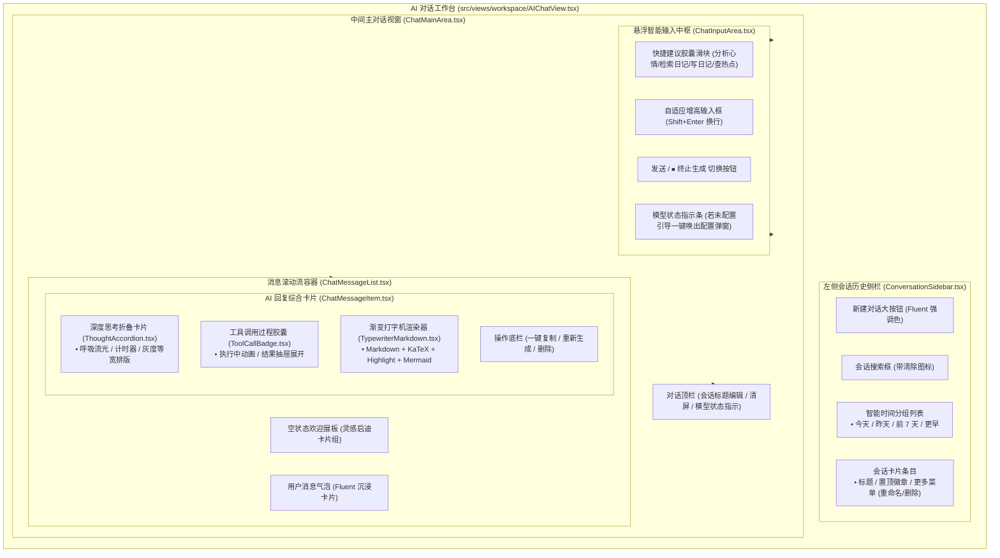

# 模块五：Fluent 2 / Acrylic 跨端 AI 对话工作台 详细设计文档

> **文档定位**：拾光手记（DiarySystem）全功能自主思考日记 AI Agent 建设体系 —— 模块五详细设计与实施指南  
> **归属工程**：`Frontend`（React 19 + Fluent UI v9 创作工作台 `src/views/workspace/` + `src/components/ai/`）  
> **文档状态**：Ready for Implementation  
> **关联总纲**：[implementation_plan.md](file:///d:/Projects/DiarySystem/Doc/AI%20Agent/implementation_plan.md)

---

## 1. 模块定位与视觉规范

### 1.1 需求背景与业务价值
AI 交互界面不应只是一个生硬的聊天气泡窗口，它是用户与私人日记世界深度对话的数字中枢。
本模块的核心目标是构建一个**完全融入系统 Windows 10/11 Fluent 2 视觉规范与亚克力玻璃拟态（Acrylic Material）的跨端 AI 对话工作台（`AIChatView.tsx`）**。

### 1.2 视觉与交互规范
1. **材质与光影（Acrylic Material）**：
   - 深度联动系统的 [`WallpaperLayer`](file:///d:/Projects/DiarySystem/Frontend/src/components/WallpaperLayer.tsx)（Bing 每日动态高清壁纸）；
   - 面板采用多层半透明磨砂（`backdropFilter: blur(24px) saturate(180%)`）与细微内外发光边框，文本对比度根据壁纸明度自动动态校准（复用 `wallpaperColor.ts`）；
2. **跨端自适应（Responsive & Adaptive）**：
   - **PC 端**：左侧 280px 优雅亚克力侧边栏（可折叠），右侧为开阔的宽屏对话交互流；
   - **移动端（<= 768px）**：对话区自适应全屏铺满，顶部汉堡按钮一键呼出手势抽屉（Drawer），软键盘弹起高度智能适配（`100dvh`）；
3. **多模态丰富内容呈现**：
   - **`<think>` 深度思考卡片**：流光呼吸灯脉冲、跳秒计时器、一键折叠；
   - **工具调用动态胶囊**：可视化展现日记检索、定位与网络搜索过程；
   - **渐变打字机流式特效**：打字光标柔和闪烁，无抖动富文本渲染；
   - **生态完整继承**：完美兼容 KaTeX 科学公式、代码高亮一键复制、Mermaid 矢量架构图全屏灯箱。

---

## 2. 前端页面布局与组件树架构



---

## 3. 核心子组件详细设计与交互实现

### 3.1 左侧会话侧边栏（`ConversationSidebar.tsx`）

- **技术职责**：会话历史拉取、本地检索过滤、时间智能归类、新建/切换/重命名/删除/置顶操作。
- **时间智能分组算法**：
  对后端拉取的会话数组按照 `updated_at` 进行动态时间分桶：
  - **今天（Today）**：`diffDays === 0`
  - **昨天（Yesterday）**：`diffDays === 1`
  - **前 7 天（Previous 7 Days）**：`2 <= diffDays <= 7`
  - **更早（Older）**：`diffDays > 7`
  - **置顶分组（Pinned）**：所有 `is_pinned === 1` 的会话置顶吸顶展示。
- **条目交互细节**：
  - **双击/菜单触发重命名**：会话标题就地转换为 Fluent `Input`，按回车或失焦即刻触发 `PUT /api/ai/conversations`；
  - **删除二次防误触**：点击垃圾桶图标弹出小型确认 Popover：“确认删除此对话吗？”，避免误删；
  - **当前选中态**：左侧带有 3px Accent 色高亮条，背景采用微光亚克力材质 `background: rgba(91, 123, 141, 0.15)`。

---

### 3.2 空会话欢迎展板（`WelcomeSlate.tsx`）

当进入新会话或无历史消息时，呈现温暖且富有启发性的 Fluent 亚克力灵感卡片组：
```
+--------------------------------------------------------------------------+
|                                🤖                                        |
|                          拾光手记 AI 助手                                 |
|         我是你的私人手记智能伴侣，已连接你的私有日记库与全网知识。        |
|                                                                          |
|   +---------------------------------+  +------------------------------+  |
|   | 📊 心理晴雨表分析               |  | 🔍 检索关于“旅行”的日记      |  |
|   | 分析我近期的心情变化趋势与走势  |  | 整理出所有写过的旅行日记与灵感|  |
|   +---------------------------------+  +------------------------------+  |
|   +---------------------------------+  +------------------------------+  |
|   | ✍️ 智能起草温馨日记             |  | 🌐 查查今日科技与前沿资讯    |  |
|   | 基于今日碎片想法，扩写成一篇随笔|  | 检索最新的科技动态与时事热点 |  |
|   +---------------------------------+  +------------------------------+  |
+--------------------------------------------------------------------------+
```
- **交互**：点击任一卡片，自动将预设 Prompt 填入输入框并即刻触发发送，无需用户繁琐构思提示词。

---

### 3.3 深度思考折叠卡片（`ThoughtAccordion.tsx`）

- **技术职责**：承载大模型的推演思维链（`<think>` / `reasoning_content`）。
- **视觉要素与动态流光**：
  - **思考进行中态**：
    - 左侧呈现 Fluent 环形流动微光动效（Pulse Glow）；
    - 显示跳秒计时器：`正在深度推演中 (6.4s)...`；
    - 卡片默认展开，内容随流式到达实时追加；
  - **思考完毕态**：
    - 流光停止，计时器固定为 `已深度思考 12 秒`；
    - 自动微动效平滑收起为紧凑的单行胶囊，避免遮挡正式回复正文；
    - 胶囊右侧显示 `展开思考过程 ▾`，用户可随时点击重温推演逻辑；
  - **内部排版**：采用淡灰背景、精细等宽字体（`JetBrains Mono, Consolas, monospace`）、字号 12px，营造沉稳、极客的思考质感。

---

### 3.4 工具调用过程胶囊（`ToolCallBadge.tsx`）

- **技术职责**：以视觉化卡片实时呈现 Agent 调用后台日记工具或网络搜索的执行过程。
- **状态流转矩阵**：
  | 状态 | 图标与动效 | 呈现文案示例 |
  | :--- | :--- | :--- |
  | **执行中** | Fluent `Spinner` 旋转微光 | `🔍 正在全文检索日记: "露营"...` |
  | **执行完成**| 浅绿圆点 / `CheckmarkCircle20Regular` | `✅ 已检索到 2 篇相关手记` |
  | **执行失败**| 浅红圆点 / `DismissCircle20Regular` | `⚠️ 检索超时，自动结合上下文作答` |
- **抽屉式展开交互**：
  - 点击卡片右侧的小箭头，可展开内嵌折叠区，直观查看工具入参（Arguments）与检索返回的片段摘要（Summary），彻底打消 AI “暗箱操作”的疑虑。

---

### 3.5 渐变打字机与富文本排版中枢（`TypewriterMarkdown.tsx`）

- **技术职责**：在流式生成中实现平滑呼吸淡入的打字机质感，并在生成完毕后提供顶级的富文本排版。
- **渐变打字光标实现**：
  在流式输出文本尾部附着微光光标元素：
  ```css
  .ai-typing-cursor {
    display: inline-block;
    width: 6px;
    height: 15px;
    margin-left: 3px;
    vertical-align: middle;
    background: linear-gradient(180deg, #5B7B8D, rgba(91, 123, 141, 0.2));
    border-radius: 2px;
    animation: typingBlink 0.8s infinite ease-in-out;
  }
  @keyframes typingBlink {
    0%, 100% { opacity: 0; }
    50% { opacity: 1; }
  }
  ```
- **富文本无缝兼容**：
  - 完整复用系统现有的 [`markdownUtils.ts`](file:///d:/Projects/DiarySystem/Frontend/src/utils/markdownUtils.ts)（KaTeX 数学公式保护算法，防止 `$` 符号被代码块冲突误伤）；
  - 代码块内置语言标签、高亮着色、以及 Fluent 风格的一键复制代码按钮；
  - 遇到 ```` ```mermaid ```` 自动挂载矢量架构图渲染引擎与灯箱放大预览。

---

### 3.6 悬浮智能输入中枢（`ChatInputArea.tsx`）

- **外形设计**：底部居中悬浮半透明亚克力卡片（宽屏最大限制 840px），与背景壁纸自然融合。
- **自适应变高机制**：
  - 默认单行高度 40px；
  - 根据输入行数通过 `textarea.scrollHeight` 动态自动撑高，上限 160px（约 6 行），超出后内部顺滑原生滚动；
  - 发送后高度瞬间重置。
- **按键事件分流**：
  - `Enter`（非输入法合成状态时）：直接发送；
  - `Shift + Enter`：换行排版；
  - 移动端：软键盘右下角适配为“发送”操作。
- **按钮双模切换**：
  - 空闲状态：展现主色发送箭头图标；
  - 生成状态：平滑变形为带有旋转边框的 `⏹ 停止生成` 按钮，点击即刻通过 `AbortController` 切断长连接。
- **模型状态与未配置引导**：
  - 输入框下方显示一行精致的小字：`当前引擎: deepseek-reasoner`；
  - 若系统检测到当前用户尚未在个人设置中配置 AI Key，输入框上方自动出现高亮提示条：“*检测到您尚未配置大模型 API，点击此处立即开启配置*”，点击直接弹出模块一的 `AiSettingsModal`。

---

## 4. 前端 API 客户端与 SSE 通信状态机（`src/api/ai.ts`）

由于浏览器原生 `EventSource` 默认仅支持 HTTP `GET` 且无法灵活携带 Request Body，前端封装基于原生 `fetch` 与 `ReadableStream` 的流式客户端：

```typescript
// Frontend/src/api/ai.ts

export interface ChatStreamCallbacks {
  onConversation?: (conv: { conversationId: string; title: string }) => void;
  onThought?: (delta: string) => void;
  onToolCall?: (toolCall: { tool: string; args: any }) => void;
  onToolResult?: (toolResult: { tool: string; summary: string; data?: any }) => void;
  onChunk?: (delta: string) => void;
  onFinish?: (data: { messageId: string; conversationId: string }) => void;
  onError?: (err: Error) => void;
}

export async function sendChatStream(
  body: { conversationId?: string; message: string },
  callbacks: ChatStreamCallbacks,
  abortSignal?: AbortSignal
): Promise<void> {
  const token = localStorage.getItem("diary_token");
  const response = await fetch("/api/ai/chat", {
    method: "POST",
    headers: {
      "Content-Type": "application/json",
      Authorization: token ? `Bearer ${token}` : "",
    },
    body: JSON.stringify(body),
    signal: abortSignal,
  });

  if (!response.ok) {
    const errJson = await response.json().catch(() => ({}));
    throw new Error(errJson.content || `请求失败 HTTP ${response.status}`);
  }

  const reader = response.body?.getReader();
  if (!reader) throw new Error("无法创建流读取器");

  const decoder = new TextDecoder("utf-8");
  let buffer = "";

  while (true) {
    const { done, value } = await reader.read();
    if (done) break;

    buffer += decoder.decode(value, { stream: true });
    const lines = buffer.split("\n\n");
    buffer = lines.pop() || ""; // 保留末尾未闭合块

    for (const block of lines) {
      if (!block.trim()) continue;
      const eventMatch = block.match(/^event:\s*([a-zA-Z_-]+)/m);
      const dataMatch = block.match(/^data:\s*(.+)$/m);

      const eventName = eventMatch ? eventMatch[1] : "chunk";
      const rawData = dataMatch ? dataMatch[1] : "";

      let parsedData: any = rawData;
      try {
        parsedData = JSON.parse(rawData);
      } catch {}

      switch (eventName) {
        case "conversation":
          callbacks.onConversation?.(parsedData);
          break;
        case "thought":
          callbacks.onThought?.(parsedData.delta || parsedData);
          break;
        case "tool_call":
          callbacks.onToolCall?.(parsedData);
          break;
        case "tool_result":
          callbacks.onToolResult?.(parsedData);
          break;
        case "chunk":
          callbacks.onChunk?.(parsedData.delta || parsedData);
          break;
        case "finish":
          callbacks.onFinish?.(parsedData);
          break;
        case "error":
          callbacks.onError?.(new Error(parsedData.error || "未知流式错误"));
          break;
      }
    }
  }
}
```

---

## 5. 路由挂载与顶栏导航修改细节

### 5.1 路由注册（`Frontend/src/App.tsx`）
在受保护路由集群中新增 AI 对话主视图：
```tsx
import { AIChatView } from "./views/workspace/AIChatView";

// 在 <Routes> 树内追加:
<Route
  path="/workspace/ai"
  element={
    <ProtectedRoute>
      <AIChatView />
    </ProtectedRoute>
  }
/>
<Route
  path="/workspace/ai/:conversationId"
  element={
    <ProtectedRoute>
      <AIChatView />
    </ProtectedRoute>
  }
/>
```

### 5.2 顶栏导航增设（`Frontend/src/components/Header.tsx`）
1. **PC 端居中导航区**：在「我的笔记」同级追加「AI 助手」按钮：
   ```tsx
   <Button
     appearance={location.pathname.startsWith("/workspace/ai") ? "primary" : "subtle"}
     icon={<Bot20Regular />}
     onClick={() => handleNav("/workspace/ai")}
     style={{
       borderRadius: "8px",
       fontWeight: location.pathname.startsWith("/workspace/ai") ? 600 : 500,
       backgroundColor: location.pathname.startsWith("/workspace/ai") ? "#5B7B8D" : undefined,
       color: location.pathname.startsWith("/workspace/ai") ? "#ffffff" : undefined,
     }}
   >
     AI 助手
   </Button>
   ```
2. **移动端汉堡折叠抽屉**：同步在移动端菜单中追加「AI 助手」导航项。

---

## 6. 文件新建与代码集成清单

| 序号 | 目标文件路径 | 变更属性 | 主要技术职责 |
| :---: | :--- | :---: | :--- |
| 1 | `Frontend/src/views/workspace/AIChatView.tsx` | **新建** | AI 对话工作台主页面，统领侧边栏、主视窗与双端响应式栅格 |
| 2 | `Frontend/src/components/ai/ConversationSidebar.tsx` | **新建** | 会话历史侧边栏（新建、时间分组、搜索、重命名、置顶、删除） |
| 3 | `Frontend/src/components/ai/ThoughtAccordion.tsx` | **新建** | `<think>` 思考过程折叠卡片组件（流光呼吸灯脉冲、跳秒计时器） |
| 4 | `Frontend/src/components/ai/ToolCallBadge.tsx` | **新建** | 工具调用过程胶囊卡片（入参展开、执行中动效、结果抽屉） |
| 5 | `Frontend/src/components/ai/ChatMessageList.tsx` | **新建** | 消息滚动容器，处理空状态欢迎卡片与自动沉底定位 |
| 6 | `Frontend/src/components/ai/ChatMessageItem.tsx` | **新建** | 单条消息卡片渲染器，集成思考折叠卡片、工具胶囊与打字机 |
| 7 | `Frontend/src/components/ai/TypewriterMarkdown.tsx` | **新建** | 渐变打字机富文本渲染引擎（支持 KaTeX、Highlight、Mermaid、复制代码） |
| 8 | `Frontend/src/components/ai/ChatInputArea.tsx` | **新建** | 底部悬浮智能输入 Dock（自适应增高、快捷 Prompt 胶囊、停止按钮） |
| 9 | `Frontend/src/api/ai.ts` | **修改/扩展** | 补充基于原生 fetch 的 `sendChatStream` SSE 读取客户端 |
| 10 | `Frontend/src/App.tsx` | **修改** | 挂载 `/workspace/ai` 与 `/workspace/ai/:conversationId` 保护路由 |
| 11 | `Frontend/src/components/Header.tsx` | **修改** | 顶栏导航增设「AI 助手」链接，移动端抽屉同步集成 |
| 12 | `Frontend/src/index.css` | **修改** | 补充 Fluent 2 亚克力对话卡片、流光呼吸边框与渐变打字光标样式 |

---

## 7. 移动端触控优化与边界容灾

1. **移动端软键盘呼出防错位**：
   - 监听 `window.visualViewport.resize` 事件，动态将输入框固定在可视区域底部，避免软键盘把输入框顶出屏幕外；
2. **历史超大长文本虚拟分段**：
   - 当单条助手回复超过 15,000 字时，分段渲染以减轻 DOM 树渲染压力，保持 60fps 顺滑滚动；
3. **未配置 AI 模型的友好引导闭环**：
   - 若用户是初次访问且未配置 API Key，点击发送直接弹出 `AiSettingsModal`，配置成功后无需刷新即可无缝回到对话流。
