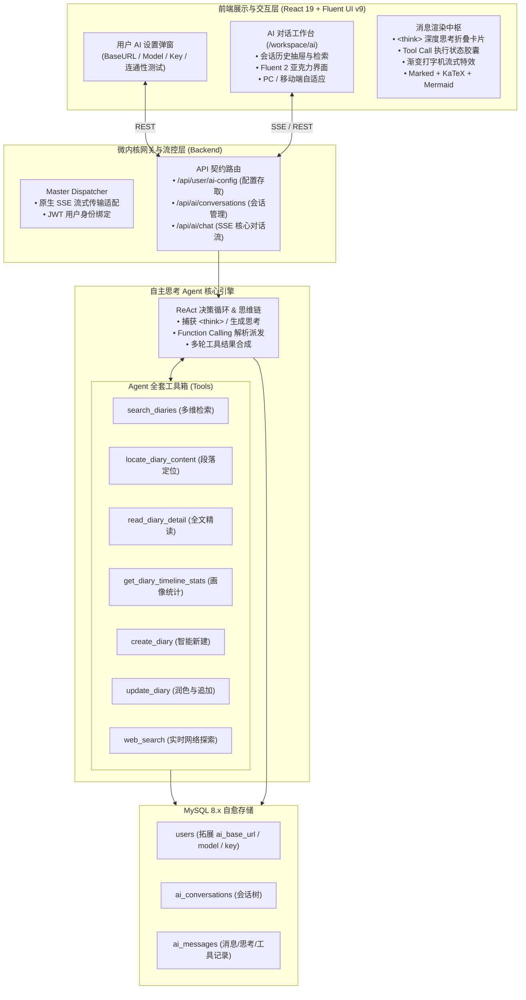

# 拾光手记（DiarySystem）全功能自主思考日记 AI Agent 设计与实现方案

## 1. 概述与需求背景

本文档规划在「拾光手记」全栈系统中引入**全功能自主思考日记 AI Agent**。
该功能赋予系统深度的个人知识检索、跨时空日记分析、智能创作辅助以及实时联网探索能力，包含五大核心模块：
1. **用户私有化 AI 引擎配置中心**：用户可在个人设置中独立配置基于 OpenAI API 兼容规范的 `baseUrl`、`modelName` 与 `apiKey`，并进行连通性实时测试；
2. **日记系统全套原生工具箱（Diary Toolset）**：为 Agent 注入全量日记检索、定位、精读、统计、创作与润色工具，彻底超越简单的单篇读取；
3. **自主思考思维链与网页搜索引擎（Chain of Thought & Web Search）**：支持原生 `<think>` 标签捕获与 ReAct 多轮循环迭代，结合无门槛实时联网检索；
4. **后端微内核 SSE 流式传输与会话持久化**：依托原生 `node:http` 实现高性能 Server-Sent Events 流式分发，同时实现会话与消息的 MySQL 自动自愈持久化；
5. **Fluent 2 / Acrylic 跨端沉浸式 AI 对话工作台**：完美遵循微软 Fluent UI v9 与 Windows 亚克力玻璃拟态规范，支持会话侧边栏管理、思维链折叠展开、渐变打字机、工具调用可视化卡片，PC 与移动端自适应。

---

## 2. 详细模块拆解与具体实现说明

---

### 模块一：用户私有化 AI 配置与个人资料拓展
每个用户均可根据自身需求配置任意兼容 OpenAI 规范的大模型（如 DeepSeek、OpenAI、Claude、Qwen、Ollama 本地模型或各类聚合 API）。

1. **数据库自愈迁移（[adminInit.ts](file:///d:/Projects/DiarySystem/Backend/src/core/admin/adminInit.ts)）**：
   - 编写 `ensureUserAiConfigColumns()`，服务启动时自愈核验并执行增量 DDL：
     - `ALTER TABLE users ADD COLUMN ai_base_url VARCHAR(512) DEFAULT NULL;`
     - `ALTER TABLE users ADD COLUMN ai_model_name VARCHAR(128) DEFAULT NULL;`
     - `ALTER TABLE users ADD COLUMN ai_api_key TEXT DEFAULT NULL;`
2. **后端配置接口（`src/api/user/ai-config/index.ts`）**：
   - `GET /api/user/ai-config`：读取当前用户的 AI 参数配置（API Key 返回脱敏与是否已配置状态）；
   - `POST /api/user/ai-config`：更新配置。支持 Base URL 末尾斜杠自动纠正、参数校验，若 API Key 留空则保留原 Key；
   - `POST /api/user/ai-config/test`：连通性实时测试端点。向目标 `baseUrl + /chat/completions` 发送一条轻量级 ping 请求，返回耗时与连通状态，便于用户在界面即时排障。
3. **前端设置界面（`AiSettingsModal.tsx`）**：
   - 遵循 Fluent UI v9 视觉规范的设置模态框；
   - 包含：
     - **API 基础地址 (Base URL)**：支持快速填入预设模板（OpenAI 官方、DeepSeek 官方、本地 Ollama 等）；
     - **模型名称 (Model Name)**：如 `deepseek-chat`、`deepseek-reasoner`、`gpt-4o`、`qwen-plus` 等；
     - **API 密钥 (API Key)**：密码密文输入框，支持一键切换明文；
     - **测试连通性按钮**：点击即时请求后端并展示状态 Badge；
     - **保存配置按钮**；
   - 在顶栏 [Header.tsx](file:///d:/Projects/DiarySystem/Frontend/src/components/Header.tsx) 用户头像下拉菜单中新增「AI 助手设置」入口，方便用户随时调出修改。

---

### 模块二：日记系统全套原生工具箱（Diary Toolset）
Agent 拥有对当前登录用户日记库的全面感知与操作能力，工具定义在 `Backend/src/core/agent/tools/`：

1. **`search_diaries`（多维度模糊/精确日记搜索）**：
   - 参数：`query`（标题或正文关键词模糊匹配）、`startDate` / `endDate`（时间跨度过滤）、`mood`（心情过滤）、`weather`（天气过滤）、`limit`（返回数量上限）；
   - 返回：匹配日记列表、时间戳、心情天气、字数统计及关键内容前 150 字摘要；
2. **`locate_diary_content`（段落级关键词精准定位与上下文抽取）**：
   - 参数：`keyword`（必须）、`diaryId`（可选，若不指定则全局扫描）；
   - 逻辑：精准扫描日记正文，提取包含关键词的命中行、行号、以及关键词前后 120 字符的上下文片段。当用户询问“我哪天去吃了烤肉”或“我在哪篇日记里提到了小明”时，可快速精准定位；
3. **`read_diary_detail`（日记全文深度精读）**：
   - 参数：`diaryId`；
   - 逻辑：读取单篇日记的完整 Markdown 内容、元数据、公开状态与历史变更时间，供 Agent 进行长文分析或总结；
4. **`get_diary_timeline_stats`（日记生命周期与心理画像统计）**：
   - 参数：`timeRange`（如 `all`、`this_month`、`recent_30_days`、`this_year`）；
   - 逻辑：统计日记总篇数、累计总字数、心情频次占比（分析近期心理晴雨表）、天气分布、创作活跃度趋势；
5. **`create_diary`（智能创建新日记）**：
   - 参数：`title`、`content`（Markdown 正文）、`weather`、`mood`、`is_public`；
   - 逻辑：经过用户确认或指令后，直接调用底层日记创建管道写入数据库并预热缓存，返回创建结果与日记 ID；
6. **`update_diary`（日记润色、修正与追加）**：
   - 参数：`diaryId`、`title`（可选）、`content`（可选）、`appendContent`（可选，追加内容）；
   - 逻辑：支持帮用户润色已有日记，或者在某篇日记末尾自动追加每日复盘与总结；
7. **`delete_diary`（删除日记）**：
   - 参数：`diaryId`、`confirmed: true`；
   - 逻辑：仅在用户明确下达删除指令且二次确认后执行软删除。

---

### 模块三：自主思考与实时网络探索引擎（ReAct & Web Search）
1. **自主思考与思维链捕获（Chain of Thought）**：
   - **原生思维链解析**：实时识别并剥离深度推理模型（如 DeepSeek-R1、o1 等）输出的 `<think>...</think>` 标签或推理字段（`reasoning_content`），以独立的 `thought` 事件下发，前端以呼吸流光卡片呈现思考过程；
   - **自主决策 ReAct 循环**：若使用的模型为通用指令模型，引擎在 Prompt 中规范工具调用规范与内部思考逻辑（Thought -> Action -> Observation -> Final Answer）。引擎支持最多 6 轮自主工具迭代：发现信息不足 -> 自主调用工具 -> 分析工具返回值 -> 继续思考或生成最终答复。
2. **实时网络搜索（`web_search` 工具）**：
   - 当用户询问实时资讯、天气预报、外部技术文档、百科常识或旅行攻略时，Agent 自主决策调用 `web_search`；
   - 后端实现健壮的免 API Key 聚合搜索抓取管道（内置智能降级与重试机制），提取网页标题、摘要 Snippet 与原始链接，格式化后作为 Observation 喂给模型，让 Agent 输出带有真实信源参考链接的高质量回复。

---

### 模块四：微内核 SSE 流式网关与会话持久化
1. **原生 `node:http` 的 SSE 流式适配**：
   - 优化 [masterDispatcher.ts](file:///d:/Projects/DiarySystem/Backend/src/dispatcher/masterDispatcher.ts)，检测到 SSE 流式响应时，设置 `Content-Type: text/event-stream`、`Cache-Control: no-cache`、`Connection: keep-alive`；
   - 流式下发标准事件协议：
     - `event: conversation`：下发当前会话 ID 与元数据；
     - `event: thought`：增量推送思考过程文本（流式打字）；
     - `event: tool_call`：推送工具调用状态（如 `{ tool: "search_diaries", args: { query: "旅行" }, status: "running" }`）；
     - `event: tool_result`：推送工具执行完成简报；
     - `event: chunk`：增量推送正式回复正文；
     - `event: finish`：通知本轮对话结束并下发落库消息 ID；
     - `event: error`：错误提示事件。
2. **会话持久化数据表（自愈建表）**：
   - `ai_conversations`：`id`, `user_id`, `title`, `created_at`, `updated_at`, `deleted_at`；
   - `ai_messages`：`id`, `conversation_id`, `role`, `content`, `thought`, `tool_calls`（JSON 字符串），`created_at`。
3. **接口路由树**：
   - `/api/ai/conversations`：GET 获取会话列表、POST 新建会话、DELETE 删除会话、PUT 重命名会话；
   - `/api/ai/messages`：GET 分页查询指定会话历史记录；
   - `/api/ai/chat`：POST 核心流式对话端点。

---

### 模块五：Fluent 2 / Acrylic 跨端 AI 对话工作台（`AIChatView.tsx`）
在前端新增专属的 AI 创作与分析界面，完全融入系统的 Win10/Win11 Fluent 2 与亚克力玻璃拟态。

1. **页面布局与路由集成**：
   - 路由：注册 `/workspace/ai` 与 `/workspace/ai/:conversationId`；
   - 顶栏 [Header.tsx](file:///d:/Projects/DiarySystem/Frontend/src/components/Header.tsx) 居中导航区新增「AI 助手」按钮（与公共广场、我的笔记同级，且移动端汉堡菜单同步加入）；
   - **PC 端**：左侧 280px 亚克力玻璃拟态侧边栏（可折叠），右侧为宽屏对话中枢；
   - **移动端**：抽屉式手势侧边栏，顶部汉堡按钮一键呼出，完美贴合移动屏幕。
2. **左侧会话历史侧边栏**：
   - 顶部提供醒目的 Fluent 质感「新建对话」按钮；
   - 会话搜索框与会话分组（今天、最近 7 天、更早）；
   - 会话卡片悬浮呈现「重命名」和「删除」快捷按钮，活动项带有 Accent 色侧边高亮与微光背景。
3. **中间对话主视窗**：
   - **欢迎状态（空会话）**：展示 Fluent 亚克力「灵感启迪卡片组」：
     - *“📊 分析我近期的心情变化趋势并给出生活建议”*
     - *“🔍 帮我检索所有关于‘学习/工作’的日记并提炼重点”*
     - *“✍️ 基于我今天随笔的几个要点，帮我扩写成一篇温馨日记”*
     - *“🌐 帮我查查最近有什么值得推荐的新技术/时事热点”*
     - 点击任一卡片直接填入并触发提问；
   - **思维链组件（`ThoughtAccordion.tsx`）**：
     - 展示 `<think>` 内容，在思考中带有流光脉冲动效（“正在深度思考中...”）；
     - 思考完毕自动收起或支持随时展开，内部采用精细灰度等宽排版；
   - **工具调用胶囊（`ToolCallBadge.tsx`）**：
     - 动态展示工具调用过程（如 `正在检索日记库: 关键词 [杭州]` -> `已读取 2 篇相关手记`），点击可展开看检索到的摘要；
   - **渐变打字机效果（Gradient Typing Effect）**：
     - 流式输出时，光标带有 WinUI 渐变光晕与字符呼吸淡入效果；
   - **富文本排版引擎**：
     - 完整复用项目已有的 `marked`、`highlight.js`、`KaTeX`、`mermaid` 渲染中枢，代码块配备一键复制与语言标识；
   - **智能输入 Dock**：
     - 居中悬浮半透明卡片设计，自适应高度多行输入，支持 Shift+Enter 换行，Enter 直接发送；
     - 底部提示当前使用的模型（若未配置，显示高亮条引导一键点击打开配置弹窗）。

---

## 3. 修改与新建文件清单

### 后端模块（Backend）
- **[NEW]** `src/core/admin/ensureAiTables.ts`：数据库自愈检查与 DDL 迁移（`users` 表拓展 AI 配置列，创建 `ai_conversations` 与 `ai_messages` 表）；
- **[NEW]** `src/core/agent/tools/diaryTools.ts`：日记系统全套原生工具集（搜索、定位、精读、画像、创建、更新、删除）；
- **[NEW]** `src/core/agent/tools/webSearchTool.ts`：实时网络搜索工具；
- **[NEW]** `src/core/agent/agentEngine.ts`：自主思考 ReAct 循环调度引擎，负责与 OpenAI 兼容端点通信、函数调用循环、流式解析与思维链提取；
- **[NEW]** `src/api/user/ai-config/index.ts`：用户 AI 配置查询、更新与连通性测试接口；
- **[NEW]** `src/api/ai/conversations/index.ts`：会话列表、新建、重命名与删除接口；
- **[NEW]** `src/api/ai/messages/index.ts`：历史消息查询接口；
- **[NEW]** `src/api/ai/chat/index.ts`：SSE 流式核心对话接口；
- **[MODIFY]** `src/index.ts`：在服务启动时调用 `ensureAiTables()` 进行自愈；
- **[MODIFY]** `src/dispatcher/masterDispatcher.ts`：支持 SSE 长连接分块流式响应机制；
- **[MODIFY]** `src/core/index.ts`：统一导出新增的核心能力。

### 前端模块（Frontend）
- **[NEW]** `src/views/workspace/AIChatView.tsx`：全新的 AI 聊天对话主工作台（适配 PC 与移动端）；
- **[NEW]** `src/components/AiSettingsModal.tsx`：用户个人资料中的 AI 配置弹窗（BaseURL / Model / Key / 连通性测试）；
- **[NEW]** `src/components/ai/ThoughtAccordion.tsx`：深度思考 `<think>` 折叠卡片与流光脉冲组件；
- **[NEW]** `src/components/ai/ToolCallBadge.tsx`：工具调用过程与结果折叠胶囊；
- **[NEW]** `src/components/ai/ChatMessageItem.tsx`：单条消息渲染器（支持渐变打字机、Markdown、公式、代码高亮、图表）；
- **[NEW]** `src/api/ai.ts`：前端 AI 模块 API 客户端（配置、会话、消息、SSE 流监听）；
- **[MODIFY]** `src/components/Header.tsx`：中间导航栏增加「AI 助手」链接，用户菜单增加「AI 助手设置」入口，移动端抽屉同步添加；
- **[MODIFY]** `src/App.tsx`：注册 `/workspace/ai` 与 `/workspace/ai/:conversationId` 保护路由；
- **[MODIFY]** `src/index.css`：补充 Fluent 2 风格的 AI 聊天、思维链流光、渐变打字机、移动端适配样式。

---

## 4. 验证与测试计划

1. **配置功能验证**：
   - 打开「AI 助手设置」弹窗，填写测试 API 地址、模型名与 Key；
   - 点击「测试连通性」，验证成功连通并提示响应延迟；保存后刷新页面验证持久化与脱敏正确。
2. **日记工具箱全面验证**：
   - 提问：“帮我看看我一共写了多少篇日记，最近心情怎么样？” -> 验证触发 `get_diary_timeline_stats`；
   - 提问：“我哪篇日记里提到了‘旅行’或者‘美食’？把那几句话摘录给我” -> 验证触发 `locate_diary_content` 并准确定位片段；
   - 提问：“帮我写一篇关于今天秋高气爽的日记，心情是轻松，天气是晴天” -> 验证触发 `create_diary` 并成功落库，在“我的笔记”列表中即时可见；
   - 提问：“帮我给刚才那篇日记末尾追加一段思考” -> 验证触发 `update_diary` 成功更新。
3. **自主思考与网页搜索验证**：
   - 使用支持思维链的模型（如 DeepSeek-R1），验证 `<think>` 标签被前端实时以折叠卡片展示打字效果；
   - 提问：“现在最新的 Node.js LTS 版本是多少？有什么新特性？” -> 验证自主调用 `web_search` 工具并结合搜索结果专业作答。
4. **交互体验与视觉验证**：
   - 验证消息流打字机渐变光晕动效与平滑滚动；
   - 验证会话新建、重命名、切换、删除功能；
   - 验证深色/浅色模式切换下的亚克力毛玻璃视觉一致性；
   - 调整浏览器视口至移动端尺寸（<= 768px），验证抽屉式侧边栏呼出、输入框防溢出与移动端触摸体验。
