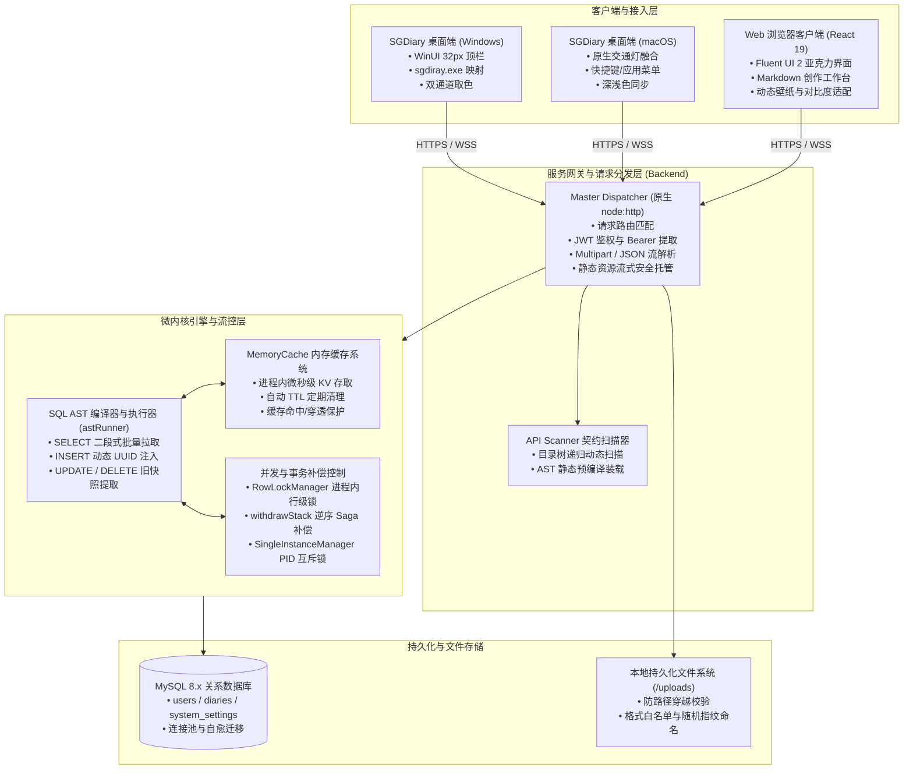
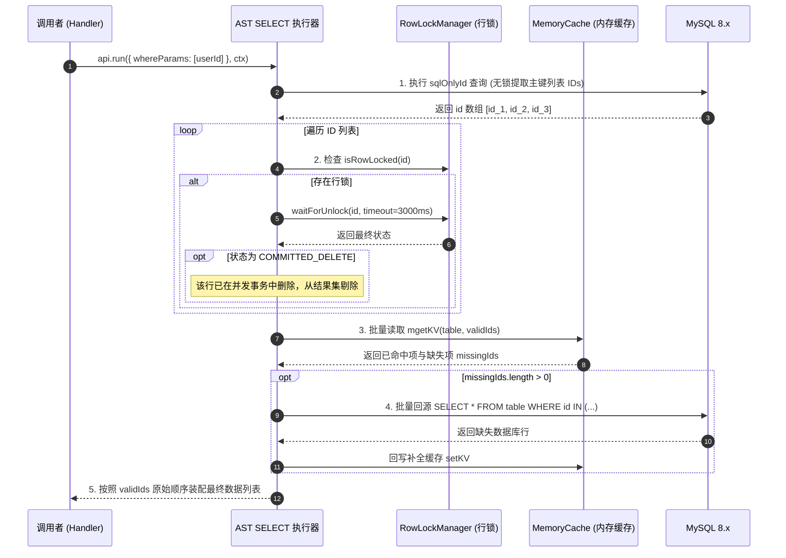
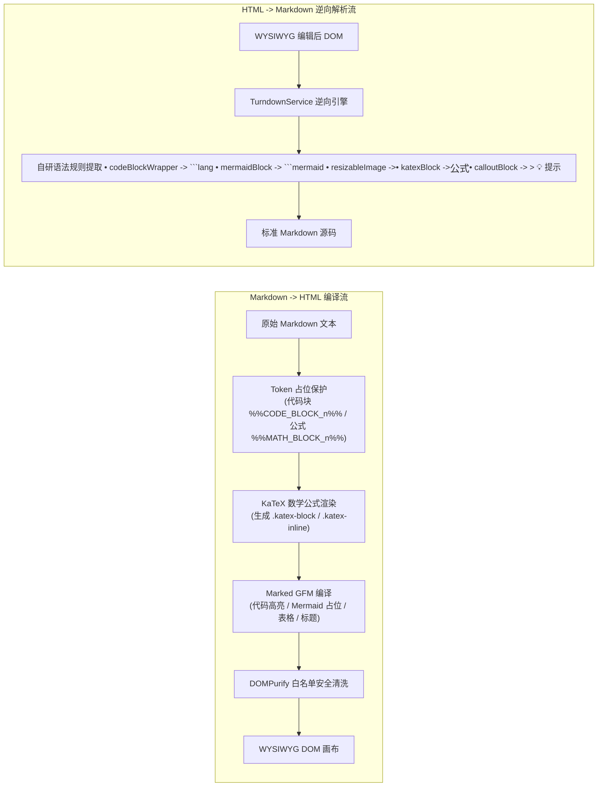
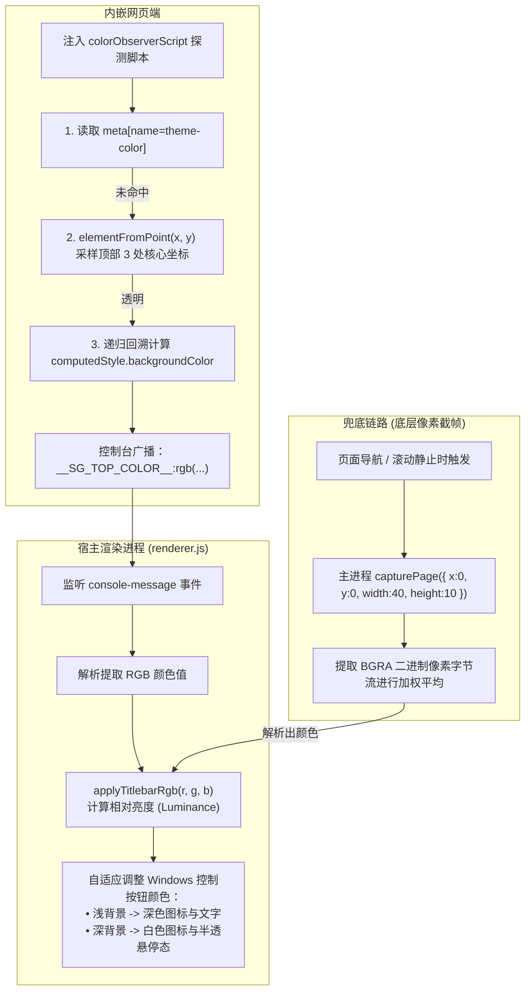
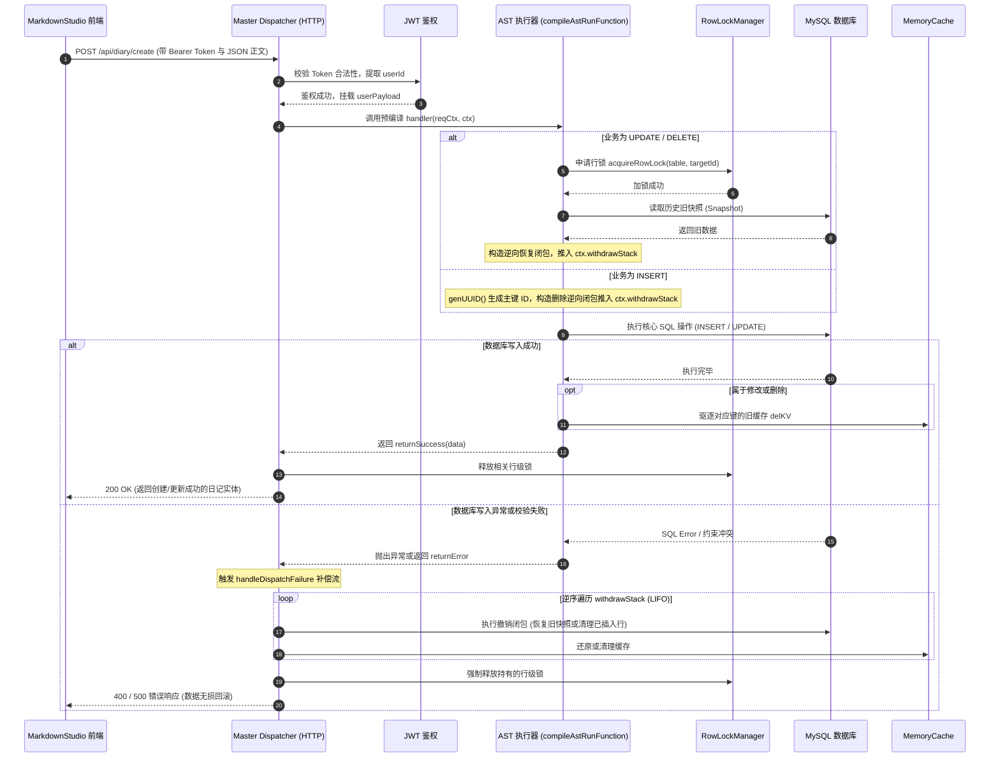

# 拾光手记（DiarySystem 与 SGDiary）技术架构与设计实现

> 本文系统梳理「拾光手记」全栈日记与个人知识管理系统的整体工程架构与核心技术实现，涵盖 Node.js 原生微内核服务端、React 19 现代化 Web 创作工作台，以及基于 Electron 的双平台桌面客户端。

---

## 1. 系统概述与工程定位

### 1.1 系统背景与业务定位
「拾光手记」是一套面向个人记录、长文写作与知识沉淀的私有化全栈系统。系统设计目标是在摆脱重型第三方 Web 框架依赖的前提下，实现高响应速度、低资源占用的服务后端；同时配合遵循 Microsoft Fluent 2 视觉规范的 Web 交互端，以及针对 Windows 与 macOS 深度原生化定制的桌面客户端，提供一致且沉浸的写作与阅读体验。

系统主要包含三个工程子系统：
1. **服务核心（`DiarySystem/Backend`）**：基于 Node.js 原生 `node:http` 模块构建的轻量级微内核服务，内部集成自研 SQL AST 语法树编译器、二段式查询引擎、进程内内存缓存、细粒度行级并发锁、LIFO 补偿撤销栈以及 PID 进程排他锁，底层存储使用 MySQL 8.x。
2. **Web 创作工作台（`DiarySystem/Frontend`）**：基于 React 19、TypeScript 与 Vite 构建的单页应用。界面采用 Fluent UI v9 组件体系与亚克力视觉风格，核心功能包含双向转换的 Markdown 创作编辑器、Mermaid 矢量图表三模态渲染、KaTeX 数学公式解析、交互式图片缩放裁剪、亚克力动态壁纸及多端响应式排版。
3. **跨平台桌面端（`SGDiary`）**：基于 Electron 构建的双平台桌面宿主外壳。针对 Windows 实现了精确符合 WinUI 规范的无边框顶栏与窗口控制；针对 macOS 对齐了原生交通灯按钮与系统菜单；内置双通道实时自适应取色算法与系统深浅色模式下发机制，并具备完全基于 Node.js Buffer 的离屏多分辨率 ICO / ICNS 图标打包流水线。

### 1.2 系统总体拓扑结构



---

## 2. 服务端微内核与数据持久层设计（Backend）

### 2.1 基于原生 `node:http` 的请求分发网关
在常见的 Node.js 项目中，开发者通常引入 Express、Koa 或 Nest.js 等框架。本项目在评估了系统的吞吐性能与依赖体积后，选择脱离外部 Web 框架，基于 Node.js 原生 `node:http` 模块实现请求分发器 `masterDispatcher.ts`。

#### 核心处理管道
`dispatchHttpRequest(req, res)` 承载了全量进站请求的统一调度，执行流程如下：
1. **基础度量与上下文初始化**：记录请求开始时间戳，生成唯一 `requestId`（UUID v4），初始化行级锁追踪列表 `lockedRows` 与补偿撤销栈 `withdrawStack`。
2. **CORS 跨域预检处理**：当检测到 HTTP 方法为 `OPTIONS` 时，立即返回标准 CORS 响应头并终止流程，降低无效链路消耗。
3. **静态文件安全流式托管**：拦截以 `/uploads/` 或 `/api/uploads/` 开头的请求，由 `serveStaticUploadFile` 处理。为杜绝路径穿越攻击（Directory Traversal），服务端提取文件名基名 `path.basename(relPath)` 并与受信任的上传目录进行拼装校验；若文件存在，则结合 MIME 表配置长效缓存响应头（`Cache-Control: public, max-age=31536000, immutable`），并通过 `fs.createReadStream(filePath).pipe(res)` 流式输出。
4. **路由匹配与鉴权拦截**：调用 `getApiRoute(pathname)` 检索内存路由注册表。如果端点配置了 `authRequired !== false`，从请求头中提取 Bearer Token 并由 `verifyJwtToken` 验证合法性；未通过则即时返回 401 错误。
5. **动态协议解析**：
   - 对 `multipart/form-data` 请求，利用 `busboy` 模块实现流式分块解析（`parseMultipartBody`），安全限制单字段与文件体积（单图上限 10MB），输出解析后的表单键值对与文件二进制缓冲流。
   - 对常规请求，基于原生流缓冲累加解析 JSON 请求体（`parseJsonBody`）。
6. **Saga 补偿撤销与并发锁回收**：
   - 接口执行成功（`status === 1`）：调用 `RowLockManager` 确认并释放事务占用的行级锁，下发 200 响应。
   - 接口业务失败或产生未捕获异常（`status === 0` 或 `catch`）：调度 `handleDispatchFailure`，以 **LIFO（后进先出）** 顺序逆序执行 `withdrawStack` 中的全部撤销闭包，回滚 MySQL 写入并将缓存状态复原，最后释放行级锁。

### 2.2 目录契约路由自动扫描（`apiScanner`）
为了在免用第三方路由库的前提下保持代码的可组织性，后端建立了约定优于配置的路由扫描机制。

```typescript
// src/dispatcher/apiScanner.ts 核心逻辑
export async function scanAndPrecompileApiRoutes(apiDir?: string): Promise<StandardResult<number>> {
  const targetDir = apiDir || path.resolve(process.cwd(), "src", "api");
  const files = getIndexFiles(targetDir);
  let count = 0;

  for (const filePath of files) {
    const fileUrl = pathToFileURL(filePath).href;
    const mod = await import(fileUrl);
    const endpoint: ApiEndpointModule = mod.api || mod.default;

    if (endpoint && typeof endpoint.handler === "function") {
      const relative = path.relative(targetDir, path.dirname(filePath)).replace(/\\/g, "/");
      const routePath = relative ? `/api/${relative}` : "/api";
      endpoint.routePath = routePath;

      // 预编译 SQL AST
      if (endpoint.astConfig) {
        endpoint.run = compileAstRunFunction(endpoint.astConfig);
      }

      registry.set(routePath, endpoint);
      count++;
    }
  }
  return returnSuccess(count);
}
```

- **路径映射规则**：服务端在启动时递归遍历 `src/api/` 目录下的所有 `index.ts`/`index.js` 文件，将其相对目录路径转化为标准 HTTP 路由。例如，`src/api/diary/create/index.ts` 将被自动映射为端点 `/api/diary/create`。
- **静态预编译装载**：如果模块导出了 `astConfig` 配置对象，扫描器会在服务启动阶段调用 `compileAstRunFunction` 完成语法树分析与执行闭包预编译，将生成的高性能执行函数直接挂载到 `endpoint.run` 上，避免运行期动态解析的 CPU 开销。

### 2.3 自研 SQL 抽象语法树（AST）编译器与执行引擎
后端核心数据流围绕一套声明式 SQL AST 体系构建，定义在 `src/core/sql/` 目录下。

#### 1. AST 节点声明体系
通过 `declare` 对象，业务模块以面向对象的方式构建查询抽象：
- `declare.table(name, as?)`：声明数据表及别名。
- `declare.column(tableNode, name, as?, functionWrapper?)`：声明数据列及可选的 SQL 聚合/包裹函数。
- `declare.where.compare(col, op, val)` 与 `declare.where.group(...)`：构建带括号分组与逻辑联结的条件树。
- `declare.limit.pageSize(page, size)`：构建标准化分页控制。

#### 2. AST 预编译执行器（`astRunner.ts`）
针对不同操作类型，`compileAstRunFunction` 编译出具备特定流控特性的执行闭包：



- **SELECT 二段式查询**：
  1. **第一段（ID 提取）**：先执行精简 SQL（仅提取满足条件的记录 `id` 列表），避免一次性把宽表全量字段读取进内存。
  2. **并发锁校判**：针对提取出的 ID，查询 `RowLockManager` 是否存在持锁更新或删除。若处于锁等待且最终被确认删除（`COMMITTED_DELETE`），则从有效结果集中剔除。
  3. **缓存加速与批量回源**：对有效 ID 列表发起 `MemoryCache.mgetKV`。对缓存未命中的 ID 集合，聚合成单条 `WHERE id IN (?, ?)` 批量从 MySQL 回源，并将回源数据回填至内存缓存，保证后续查询在微秒级别命中。
  4. **原序装配**：最终按照最初 ID 序列重构输出数组，维护预设排序。
- **INSERT 自动注入与撤销注册**：
  - 支持检测主键缺省状态，由底座统一通过 `genUUID()` 生成 UUID v4 注入，并在执行插入后将对应的逆向删除操作（`undoSql: DELETE FROM table WHERE id = ?` 及清理脏缓存）包装为闭包推入 `ctx.withdrawStack`。
- **UPDATE / DELETE 悲观行锁与旧快照留存**：
  - 更新或删除前，先调用 `RowLockManager.acquireRowLock` 锁定目标记录，避免并发脏写。
  - 通过 `lockSql` 查询当前行的全量数据快照（Snapshot）。
  - 执行真实 SQL 修改或删除，并即刻驱逐内存中的旧数据（`delKV`）。
  - 将恢复快照数据的逆向 SQL（`UPDATE ... SET ...` 或 `INSERT ...`）推入 `ctx.withdrawStack`，确保后续步骤崩溃时能够无损回滚。

### 2.4 并发控制与高可用保障
1. **进程内行级锁管理器（`RowLockManager`）**：
   - 维护 `Map<string, RowLockState>` 键值结构，键格式为 `lock:${table}:${id}`。
   - 提供超时自愈机制：锁默认具有最大持有时效（默认 10000ms），超出时效强制剔除，杜绝死锁。
   - 支持同一请求上下文内安全重入。
   - 基于 Node.js `EventEmitter` 实现 `waitForUnlock` 异步监听唤醒机制，替代低效的轮询等待。
2. **轻量级内存缓存（`MemoryCache`）**：
   - 单进程内通过 `Map<string, CacheEntry>` 维持高频读模型，免去跨网调用 Redis 的网络延迟。
   - 包含惰性过期读取校判与每 60 秒定期扫描的主动清理定时器。
3. **单实例排他进程守护（`SingleInstanceManager`）**：
   - 服务启动时在根目录生成 `.instance.lock` 记录本进程 PID、Node ID、监听端口与时间戳。
   - 启动前核验锁文件中的 PID 是否通过 `process.kill(pid, 0)` 存活；若存在冲突实例则终止启动并打印清晰告警；若原进程已消亡则自愈清理残留文件并接管。
   - 进程退出时注册 `process.once("exit")` 钩子自动回收锁文件。
4. **基础设施自动演进与自愈（Self-Healing）**：
   - 服务每次启动均自动执行 `ensureSuperAdminAccount`，比对超级管理员凭据哈希，缺失则自动创建，密码漂移则自动无损校准。
   - 自动执行 `ensureSystemSettingsTable` 与 `ensureUserAvatarColumn`，对缺失的全局设置表或新增字段进行增量 DDL 补齐，降低环境初始化与升级负担。

---

## 3. 前端工作台与核心交互设计（Frontend）

### 3.1 技术选型与分层状态中枢
前端采用 React 19 配合微软官方 **Fluent UI v9**（`@fluentui/react-components`）设计体系构建，视觉上遵循亚克力玻璃拟态（Acrylic Material）风格与 Windows 10/11 流畅动效规范。

```
DiarySystem/Frontend/src/
├── api/             # 统一封装的 RESTful 客户端 (auth, diary, upload, wallpaper)
├── components/      # 业务通用原子组件 (MarkdownViewer, NoteCard, Header, Modals)
├── context/         # 核心上下文 (AuthContext, PageCacheContext, ThemeContext, WallpaperContext)
├── utils/           # 算法与编译工具库 (markdownUtils, markdownDiagrams, dialogMotion, wallpaperStorage)
└── views/           # 页面路由视图 (PublicShowcase, AuthPortal, NotesManager, MarkdownStudio, UserManager)
```

- **无感页面缓存（`PageCacheContext`）**：针对笔记列表页与用户管理页，在 Context 中建立视图状态缓存字典。当用户从编辑页返回列表页时，优先渲染本地内存快照，避免列表空白加载骨架屏或重复触发后端接口。
- **未保存路由拦截系统**：在 `MarkdownStudio` 编辑器中，监听 `beforeunload` 原生事件防止意外刷新或关闭标签页；同时向全局挂载 `window.__checkUnsavedBeforeNavigate` 钩子，拦截单页应用内顶栏导航跳转，弹出 Fluent UI 规范的确认模态框。

### 3.2 专业 Markdown 创作工作台（`MarkdownStudio.tsx`）
`MarkdownStudio` 是前端最核心的单体模块，源码体量超 110KB，融合了富文本渲染与原生 Markdown 的优势。

#### 1. 三模态画布切换体系
编辑器提供三种工作模态：
- **WYSIWYG（所见即所得画布）**：依托 `contentEditable` 容器，实时呈现排版效果，支持直接在画布上选中文本进行加粗、斜体、列表、引用与多级标题调整。
- **Sheet（即时排版稿纸模式）**：左右分栏，左侧为纯文本 Markdown 源码编辑区，右侧为带格式的实时同步渲染区。
- **Preview（纯享阅读模式）**：隐藏所有编辑控件，以最佳排版比例全屏呈现文章内容。
此外，提供 880px（默认专注宽度）、1240px（宽屏模式）与 100%（全宽模式）三种画布宽度切换，并持久化到本地。

#### 2. Markdown 与 HTML 双向编译与标记保护算法
编辑器支持源码模式与可视化画布之间无缝切换，其底层依赖于 `markdownUtils.ts` 中的双向转换引擎：



- **数学公式冲突规避**：在编译前，使用正则表达式将代码块与行内代码提权保护并替换为独立 Token，防止代码中的 `$` 符号被误解析为 LaTeX 公式；处理完块级 `$$...$$` 与行内 `$...$` 的 KaTeX 渲染后，再将 Token 准确还原。
- **排版参数持久化**：对于在可视化画布中被调整过尺寸或对齐方式的图片，Turndown 会自动输出包含 `data-width`、`data-align` 与内联 `style` 的可调尺寸 `` 标签；对于未调整的普通图片，则优雅回退为标准 Markdown 语法 ``。

#### 3. Mermaid 矢量图表三模态渲染器（`markdownDiagrams.ts`）
每张内嵌的 Mermaid 图表均被包裹在一个独立的 `.mermaid-diagram-container` 容器内，具备三模态即时切换能力：
1. **Diagram 模式**：展示矢量渲染生成的 SVG 图形，并提供放大全屏灯箱功能。
2. **Code 模式**：高亮展示图表原始 Mermaid 源码，支持快速编辑。
3. **Split 模式**：同屏并排对比渲染结果与图表源码。
4. **容错降级**：若图表语法编写有误，自动展示红底错误说明与原始代码块，避免整页渲染崩溃。在触摸屏和移动端设备上，系统会自动隐藏复杂控制条，强制采用干净的 Diagram 视图。

#### 4. 可视化图片交互与防误删机制
- 用户在 WYSIWYG 画布中点击任何图片，编辑器会动态计算并在图片四周附着一层包含尺寸调节手柄（Resize Handles）的覆盖层，允许用户直观拖拽缩放图片宽度，或通过工具条切换左浮动、居中或右对齐。
- 在编辑器中删除图片时，系统提供浮动撤回（Undo）消息条，允许在预设倒计时内一键恢复已被移除的图片节点与排版定位。

### 3.3 亚克力壁纸与自适应对比度系统
为提升沉浸感，系统在底座部署了 `WallpaperContext` 与 `WallpaperLayer`。
- **首屏 0ms 秒开设计**：从网络获取的 Bing 每日高清壁纸在首次载入后，利用 Canvas 转换提取为 Base64 快照存储于 LocalStorage 中。在用户后续刷新或二次访问时，初始化脚本在第 0 毫秒直接注入该 Base64 快照，彻底规避了网络图片加载阶段的白屏与闪烁现象。
- **文字对比度自适应算法**：`wallpaperColor.ts` 实时分析壁纸主要区域的明度（Luminance）。若检测到壁纸偏浅，系统自动加深卡片投影、边框透明度与文字阶度，确保文章文本在任何复杂背景下均具备清晰的可读性。

### 3.4 交互式图像裁剪引擎（`AvatarCropModal.tsx`）
在用户头像设置中，系统自研了基于 HTML5 Canvas 的裁剪模块：
- 支持图片在画布中通过鼠标拖拽进行任意平移、通过滚轮或滑块在 0.2x 至 3.5x 范围平滑缩放，以及 90 度步进旋转。
- 提供圆形掩膜与方形掩膜无缝切换。
- 右侧实时联动渲染 100×100 方形、80×80 大圆形与 40×40 小圆形三重视图预览。
- 最终导出裁剪后的 JPEG/PNG Base64 编码，提交至 `/api/user/avatar` 接口由后端入库。

---

## 4. 跨平台桌面客户端工程实现（SGDiary）

`SGDiary` 是基于 Electron（Chrome 152+ 内核）构建的桌面端外壳，代码位于 `e:/Projects/Personal/SGDiary`。

### 4.1 双平台原生化窗口差异化适配
桌面端致力于消除“纯网页套壳”的违和感，针对不同操作系统实施了深度原生定制：

| 平台特性 | Windows 端实现方案 | macOS 端实现方案 |
| :--- | :--- | :--- |
| **窗口边框** | `frame: false` 无边框设计 | `frame: false` + `titleBarStyle: 'hidden'` |
| **顶部控制栏** | 纯 HTML/CSS 实现标准 WinUI 顶栏（高度精确 32px，控制按钮 46×32px） | 原生系统级红黄绿交通灯控制（Traffic Light，对齐位置 `{ x: 14, y: 9 }`） |
| **窗口按钮控制** | 自定义最小化、最大化/向下还原、关闭按钮及图标平滑切换 | 自动隐藏 HTML 控制按钮，完全交由 macOS 窗口管理器接管 |
| **系统应用菜单** | 禁用原生顶层菜单（`Menu.setApplicationMenu(null)`）保持沉浸 | 注册标准 macOS 应用菜单（关于、隐藏、服务、撤销/重做、剪切/复制/粘贴、全选） |
| **系统进程标识** | 开发阶段通过 `setup-executable.js` 映射复制生成 `sgdiray.exe` 进程 | 使用原生 Electron 进程标识 |

```javascript
// scripts/setup-executable.js
// 为 Windows 调试环境提供一致的进程名体验
function setupExecutable() {
  if (process.platform !== 'win32') return;
  const electronDistDir = path.join(__dirname, '..', 'node_modules', 'electron', 'dist');
  const originalExe = path.join(electronDistDir, 'electron.exe');
  const customExe = path.join(electronDistDir, 'sgdiray.exe');

  if (fs.existsSync(originalExe) && !fs.existsSync(customExe)) {
    fs.copyFileSync(originalExe, customExe);
  }
}
```

### 4.2 实时自适应双通道取色机制
为使桌面窗口顶部控制栏与内嵌的 Web 网页完全融为一体，`SGDiary` 设计了**「DOM 实时感知 + 底层像素截帧兜底」**的双通道取色系统：



#### 相对亮度与按钮样式换算
在提取到有效 RGB 值后，程序通过相对亮度加权公式换算背景明度：
$$\text{Luminance} = \frac{0.299 \times R + 0.587 \times G + 0.114 \times B}{255}$$
若 $\text{Luminance} < 0.5$ 则判定为深色背景，自动将顶栏文字与矢量图标设为高亮白（`#ffffff`），悬停背景设为浅白半透明（`rgba(255, 255, 255, 0.12)`）；反之切换为沉浸黑（`#1a1a1a`），从而始终确保控制控件的高辨识度。

### 4.3 操作系统外观模式联动
主进程通过监听 Electron 的 `nativeTheme.on('updated')` 事件捕获操作系统的深浅色切换，并通过两种方式无损穿透至内嵌页面：
1. **CSS 变量注入**：向目标 `<webview>` 页面动态注入 `:root { color-scheme: dark !important; }`。
2. **CDP 媒体模拟**：调用 Chrome DevTools Protocol（CDP）的 `Emulation.setEmulatedMedia` 协议，动态修改页面的 `prefers-color-scheme` 媒体特性，让 Web 页面内的 CSS Media Query 与 Fluent UI 主题即时响应。

### 4.4 纯 Node.js 的图标离屏光栅化与二进制打包流水线（`generate-icons.js`）
通常项目中需要借助 ImageMagick、Python 等庞大工具链来生成 ICO 和 ICNS 图标。`SGDiary` 编写了纯 JavaScript 结合 Electron 基础环境的自动化构建脚本：

1. **离屏光栅化（Offscreen Rendering）**：
   - 启动一个带有 `offscreen: true` 标记的无头 BrowserWindow。
   - 装载 `src/logo.svg` 并等待字体与矢量排版完成。
   - 使用 `win.capturePage({ width: 1024, height: 1024 })` 生成 1024×1024 超清 PNG。
2. **多尺度降采样**：基于 `nativeImage.resize({ width, height, quality: 'best' })` 批量计算生成 `[512, 256, 128, 64, 48, 32, 16]` 等全套尺寸的 PNG Buffer。
3. **纯二进制装配 Windows `.ico` 文件**：
   - 构造 6 字节的 ICO 标准头（Reserved: 0, Type: 1, Count: N）。
   - 为每个分辨率分配 16 字节的目录条目（Entry），记录尺寸、色深、偏移量与字节长度。
   - 拼接目录区与各分辨率的 PNG 数据块，输出符合 Windows 规范的 `assets/icon.ico`。
4. **纯二进制装配 macOS `.icns` 文件**：
   - 构造 4 字节魔数 `'icns'` 与 4 字节文件总长度。
   - 循环写入现代 macOS 标准 Chunk 标头（如 `icp4`、`icp5`、`ic11`、`ic07`、`ic10` 等）及对应尺度的 PNG 字节流，输出标准的 `assets/icon.icns`。

### 4.5 跨平台自动化 CI/CD 构建
项目在 `.github/workflows/build.yml` 中建立了跨平台构建矩阵，可在标签推送（Tag Push）或手动触发时，在 GitHub 托管的 macOS 与 Windows 云端虚拟机中自动化执行打包：
- **Windows 构建产物**：64 位 NSIS 安装引导包（`.exe`）与免安装便携版单文件（Portable `.exe`）。
- **macOS 构建产物**：兼容 Apple Silicon（`arm64`）与 Intel（`x64`）的 DMG 挂载磁盘镜像与 ZIP 分发归档包。

---

## 5. 核心业务全链路时序追踪

### 5.1 日记创建与更新事务全流程



---

## 6. 技术选型权衡与工程总结

在「拾光手记」从设计到落地的整个演进过程中，技术决策主要围绕**“轻量、可控、原生体验与高内聚”**展开：

1. **自研微内核 vs 成熟后端框架**：
   - *权衡*：引入 Nest.js 或 Express 固然能够快速获取庞大的生态插件，但同时也带来了数十兆的 node_modules 依赖以及较深的调用调用栈。
   - *收益*：自研微内核将 HTTP 路由分发、AST 预编译执行、行级锁与 Saga 事务撤销收敛在几千行纯净的 TypeScript 代码内。不仅冷启动在毫秒级完成，内存开销亦保持在较低水位，便于在低配云服务器上稳定运行。
2. **富文本与 Markdown 双向编译器**：
   - *权衡*：纯 Markdown 编辑器对普通排版不够直观；纯富文本（如 Quill、ProseMirror）在存储时容易产生冗余垃圾标签，难以进行版本管理与多端互通。
   - *收益*：采用以标准 Markdown 为单一事实来源（Single Source of Truth），通过定制的 Marked 与 Turndown 规则实现所见即所得画布与源码的平滑切换，既保证了排版效率，又维护了纯文本沉淀的通用性。
3. **桌面端原生融合设计**：
   - *权衡*：常规 Electron 应用往往直接沿用网页顶栏，或使用平台无关的统一标题栏，在 macOS 与 Windows 上显得割裂。
   - *收益*：针对 Windows 模拟 WinUI 无边框顶栏，针对 macOS 启用隐藏式标题栏并贴合交通灯按钮；配合双通道取色机制，使桌面窗口与日记系统的各色壁纸能够融为一体。
4. **离屏构建与极简打包**：
   - *权衡*：依赖外部图标转换 CLI 容易受环境版本干扰。
   - *收益*：直接复用运行时 Electron 的离屏能力光栅化 SVG，并用 Node.js Buffer 手工打包标准 ICO 和 ICNS 二进制数据，使工程构建过程做到了零外部原生工具依赖。

---

*文档编写完毕，内容客观陈述系统代码实现与技术细节，可直接用于个人技术博客与知识主页发布。*
