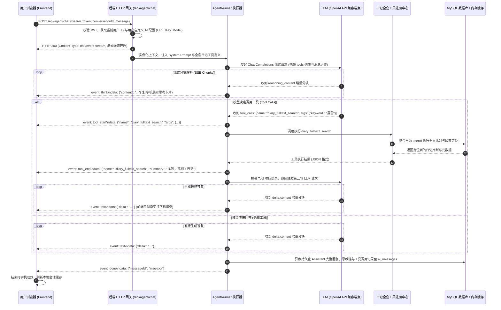

# 拾光手记（DiarySystem）日记 AI Agent 全栈架构设计与实施方案

> **文档版本**：v1.0.0  
> **面向系统**：DiarySystem 后端微内核服务（Backend） + React 19 现代化 Web 创作端（Frontend）  
> **设计定位**：为「拾光手记」打造一个兼备自主推理思考（Reasoning / Think）、实时网页搜索、本日记系统全套深度工具生态、以及遵循 Microsoft Fluent 2 亚克力美学的全栈智能体系统。

---

## 1. 系统概述与业务定位

### 1.1 业务价值与功能全景
日记不仅是随手记录的载体，更是个人思维沉淀与人生轨迹的数据资产。传统的日记应用检索单一、缺乏自省与联想能力。本项目规划的 **日记 AI Agent** 旨在成为用户的“数字外脑”与“共鸣伴侣”：
1. **自主思考与推理**：支持捕获大模型的思维链过程（`<think>` / `reasoning_content`），以现代化卡片形式折叠展开呈现思考逻辑。
2. **本日记系统全套自主调用工具**：提供不仅限于读取单篇日记的工具箱，包含日记模糊标题搜索、全文多段落定位、时间/天气/心情复合过滤、情绪与创作走势统计、新日记智能起草与现有日记修订。
3. **最新外部互联网搜索**：具备内置 Web 搜索能力，使 Agent 能够将外部世界的客观知识与用户的私人笔记无缝链接。
4. **自定义模型接入**：在用户个人资料配置中提供专属的 `Base URL`、`Model Name` 和 `API Key`，完全兼容 OpenAI API 规范（支持 DeepSeek-R1/V3、OpenAI o1/o3/gpt-4o、Moonshot、Qwen、Ollama、vLLM 等任意兼容端点）。
5. **Fluent 2 顶级交互视觉**：双端（PC/移动端）响应式布局、亚克力毛玻璃拟态、平滑打字机渐变流式输出、Mermaid 矢量图与数学公式完备渲染。

---

## 2. 总体架构与数据流设计

### 2.1 整体架构拓扑图

```mermaid
flowchart TB
    subgraph ClientUI["前端展示层 (Frontend - React 19 + Fluent UI v9)"]
        direction TB
        SettingsView["用户资料设置模态框<br/>(Base URL / Model / Key 配置与连通测试)"]
        AgentPage["AI 对话工作台 (AiAgentStudio)"]
        
        subgraph ChatComponents["对话核心组件树"]
            Sidebar["会话列表侧边栏 (ConversationSidebar)<br/>• 时间分组 / 搜索 / 置顶 / 删除"]
            MsgList["消息渲染中枢 (ChatMessageList)"]
            ThinkCard["思考折叠卡片 (ThoughtAccordion)<br/>• 计时器 / 呼吸灯动效"]
            ToolBadge["工具调用状态徽章 (ToolExecutionBadge)<br/>• 入参透视 / 结果折叠"]
            MDStream["流式渐变打字机 (TypewriterMarkdown)<br/>• KaTeX / Highlight / Mermaid"]
            InputBox["多功能输入中枢 (ChatInputArea)<br/>• 自动变高 / 预设 Prompt / 终止流"]
        end
        
        AgentPage --> Sidebar
        AgentPage --> MsgList
        MsgList --> ThinkCard
        MsgList --> ToolBadge
        MsgList --> MDStream
        AgentPage --> InputBox
    end

    subgraph BackendGateway["服务网关与接口调度层 (Backend - 原生 node:http)"]
        Router["Master Dispatcher<br/>• JWT 鉴权与身份提取<br/>• SSE 分块长连接管理 (Transfer-Encoding: chunked)"]
        AgentRoutes["/api/agent/* 契约路由<br/>• /chat (SSE 流式输出)<br/>• /conversations (会话 CRUD)<br/>• /user/ai-config (模型配置与测试)"]
    end

    subgraph AgentCore["Agent 运行时与决策中枢 (src/core/agent)"]
        Runner["AgentRunner 循环调度器<br/>• ReAct / Function Calling 循环 (最大轮次保护)<br/>• 思考流/正文流分流解析器"]
        LLMClient["OpenAI 兼容协议客户端 (llmClient)<br/>• SSE 增量解码<br/>• reasoning_content / delta 分流"]
        Registry["AgentToolRegistry 工具中心<br/>• JSON Schema 契约导出<br/>• 工具执行器动态分发"]
    end

    subgraph ToolEcosystem["本日记全套工具集与外部网络 (Tools)"]
        direction TB
        T_Title["diary_search_titles<br/>(标题与概要模糊检索)"]
        T_Text["diary_fulltext_search<br/>(全文多段落定位与行号高亮)"]
        T_Detail["diary_get_detail<br/>(全篇日记与元数据读取)"]
        T_Meta["diary_query_by_meta<br/>(日期/心情/天气/公开复合过滤)"]
        T_Stat["diary_get_statistics<br/>(篇数/字数/情绪分布/创作习惯统计)"]
        T_Create["diary_create_draft<br/>(协助起草并入库新日记)"]
        T_Update["diary_update_content<br/>(协助修订现有日记，行锁保护)"]
        T_Web["web_search<br/>(互联网前沿资讯检索)"]
    end

    subgraph StorageLayer["持久化与缓存基础设施"]
        DB_Users["users 表 (新增 AES-256 加密字段)"]
        DB_Conv["ai_conversations 表 (会话元数据)"]
        DB_Msg["ai_messages 表 (消息/思考/工具记录)"]
        DB_Diaries["diaries 表 (日记资产库)"]
        MemCache["MemoryCache 内存缓存"]
    end

    ClientUI <-->|HTTP REST / SSE 流式推送| Router
    Router --> AgentRoutes
    AgentRoutes --> AgentCore
    AgentCore --> LLMClient
    AgentCore --> Registry
    Registry --> ToolEcosystem
    ToolEcosystem --> DB_Diaries
    ToolEcosystem --> MemCache
    AgentCore --> DB_Conv
    AgentCore --> DB_Msg
    SettingsView --> DB_Users
    LLMClient <-->|OpenAI API 协议 (HTTPS)| ExternalLLM["外部大模型接入点 (DeepSeek / OpenAI 等)"]
```

---

### 2.2 端到端通信时序流水线



---

## 3. 数据库模式演进与自愈设计（Database Evolution）

紧密沿用本系统已有的 **“启动自愈检测（Self-Healing）”** 模式（类似于现有 [`ensureSuperAdminAccount`](file:///d:/Projects/DiarySystem/Backend/src/core/admin/adminInit.ts) 和 [`ensureSystemSettingsTable`](file:///d:/Projects/DiarySystem/Backend/src/core/settings/systemSettings.ts)），在 `src/core/agent/agentDbInit.ts` 中实现全自动模式探测与无损补齐，无需任何手动手动跑 SQL 脚本。

### 3.1 实体设计与 DDL 规划

#### 1. `users` 表扩展字段（用户自定义模型配置）
| 字段名 | 类型 | 默认值 | 描述 |
| :--- | :--- | :--- | :--- |
| `ai_base_url` | `VARCHAR(512)` | `NULL` | 自定义 OpenAI 兼容端点（如 `https://api.deepseek.com/v1`） |
| `ai_model_name` | `VARCHAR(128)` | `NULL` | 自定义模型名（如 `deepseek-reasoner`、`gpt-4o`） |
| `ai_api_key` | `TEXT` | `NULL` | AES-256-GCM 加密存储的 API 秘钥，保障多用户私密安全 |

#### 2. `ai_conversations` 表（对话会话表）
```sql
CREATE TABLE IF NOT EXISTS ai_conversations (
  id VARCHAR(64) PRIMARY KEY,
  user_id VARCHAR(64) NOT NULL,
  title VARCHAR(255) NOT NULL DEFAULT '新建手记对话',
  is_pinned TINYINT(1) NOT NULL DEFAULT 0,
  created_at DATETIME NOT NULL DEFAULT CURRENT_TIMESTAMP,
  updated_at DATETIME NOT NULL DEFAULT CURRENT_TIMESTAMP ON UPDATE CURRENT_TIMESTAMP,
  INDEX idx_user_updated (user_id, updated_at DESC)
) ENGINE=InnoDB DEFAULT CHARSET=utf8mb4 COLLATE=utf8mb4_unicode_ci;
```

#### 3. `ai_messages` 表（对话消息与思考沉淀表）
```sql
CREATE TABLE IF NOT EXISTS ai_messages (
  id VARCHAR(64) PRIMARY KEY,
  conversation_id VARCHAR(64) NOT NULL,
  user_id VARCHAR(64) NOT NULL,
  role ENUM('user', 'assistant', 'system', 'tool') NOT NULL,
  content LONGTEXT NOT NULL,
  reasoning_content LONGTEXT NULL COMMENT '思考链过程内容，兼容 deepseek-reasoner / o1 等',
  tool_calls JSON NULL COMMENT '模型发起的工具调用定义数组',
  tool_call_id VARCHAR(128) NULL COMMENT '对应工具结果返回时的调用关联 ID',
  tokens_info JSON NULL COMMENT '消耗 tokens 与生成耗时统计',
  created_at DATETIME NOT NULL DEFAULT CURRENT_TIMESTAMP,
  INDEX idx_conv_created (conversation_id, created_at ASC),
  INDEX idx_user_created (user_id, created_at DESC)
) ENGINE=InnoDB DEFAULT CHARSET=utf8mb4 COLLATE=utf8mb4_unicode_ci;
```

### 3.2 自愈初始化逻辑（`ensureAiSystemTables`）
- 在 `Backend/src/index.ts` 启动流程的数据库连通性核验通过后直接执行。
- 逐字段检查 `users` 表是否存在 `ai_base_url`、`ai_model_name`、`ai_api_key`，若缺失则通过 `ALTER TABLE users ADD COLUMN ...` 无损补全。
- 检测并自动创建 `ai_conversations` 与 `ai_messages` 表。

---

## 4. 后端微内核模块详细拆解与实现方案（Backend）

后端新增核心功能严格遵循当前工程的微内核规范，不使用任何外部长框架，完全依托原生 `node:http` 和已有基础设施。

```
Backend/src/
├── core/
│   └── agent/                     # [NEW] Agent 核心子系统
│       ├── agentDbInit.ts         # 数据库自愈检测与模式初始化
│       ├── llmClient.ts           # OpenAI 兼容协议流式客户端
│       ├── agentRunner.ts         # 自主规划思考与 ReAct 调度中枢
│       ├── promptTemplates.ts     # 系统角色设定与元规则
│       ├── cipherHelper.ts        # API Key 本地 AES 加密/解密
│       └── tools/                 # [NEW] 全套日记工具库
│           ├── types.ts           # 工具契约接口与 JSON Schema 定义
│           ├── index.ts           # 工具统一注册与分发中心
│           ├── diarySearch.ts     # 标题模糊搜索与全文高亮定位
│           ├── diaryDetail.ts     # 日记详情提取
│           ├── diaryFilter.ts     # 日期/心情/天气复合筛选
│           ├── diaryStats.ts      # 情绪走势与写作数据统计
│           ├── diaryMutate.ts     # 日记草稿起草与安全更新
│           └── webSearch.ts       # 互联网前沿资讯检索
└── api/
    ├── agent/                     # [NEW] 契约路由端点
    │   ├── chat/index.ts          # SSE 流式主通信通道 (/api/agent/chat)
    │   ├── conversations/
    │   │   ├── list/index.ts      # 会话列表 (/api/agent/conversations/list)
    │   │   ├── create/index.ts    # 新建会话 (/api/agent/conversations/create)
    │   │   ├── update/index.ts    # 重命名/置顶 (/api/agent/conversations/update)
    │   │   ├── delete/index.ts    # 删除会话 (/api/agent/conversations/delete)
    │   │   └── messages/index.ts  # 会话消息历史 (/api/agent/conversations/messages)
    └── user/
        └── ai-config/             # [NEW] 用户 AI 配置与连通测试
            ├── index.ts           # 配置读取与保存 (/api/user/ai-config)
            └── test/index.ts      # 连通性测试 (/api/user/ai-config/test)
```

---

### 4.1 模块 1：OpenAI API 兼容流式客户端（`llmClient.ts`）

- **技术职责**：
  1. 封装符合 OpenAI API 规范的 `POST /v1/chat/completions` 请求；
  2. 支持 HTTP Header `Authorization: Bearer <API_KEY>`；
  3. 基于原生 `fetch` 与 `ReadableStream` 逐行解析 Server-Sent Events（SSE）流；
  4. 深度适配思考模型：同时捕获普通响应分块 `delta.content`，以及思考模型的推演分块 `delta.reasoning_content`（或模型输出文本内的 `<think>...</think>` 标签）；
  5. 增量组装分块的 `delta.tool_calls`（处理流式返回中的工具名称与 JSON 参数片段拼接）。
- **回调事件机制**：
  ```typescript
  export interface StreamCallbacks {
    onThinkChunk?: (thinkText: string) => void;
    onTextChunk?: (deltaText: string) => void;
    onToolCallChunk?: (toolCallDelta: any) => void;
    onError?: (err: Error) => void;
    onDone?: (fullResult: { text: string; reasoning: string; toolCalls: any[] }) => void;
  }
  ```

---

### 4.2 模块 2：自主思考决策中枢（`agentRunner.ts`）

- **技术职责**：
  1. **System Prompt 注入**：设定严密的助手人格规范——
     - “你是「拾光手记」私有化系统的专属 AI Agent 与智能阅读分析伴侣”；
     - 严格约束数据隐私：用户的所有日记均为本地私有数据，仅当前用户有权查阅；
     - 严谨调用工具：在回答用户关于以往笔记、心情趋势、某一天的记录等问题时，**必须**优先调用日记工具检索真实数据，严禁无依据臆造；
  2. **多轮 Tool Calling 执行闭包（ReAct 循环）**：
     - 单次会话设定最大迭代轮次（如 `MAX_STEPS = 5`），避免大模型因死循环导致接口挂起；
     - 第一轮：携带用户最新问题与会话历史，下发包含全套日记工具定义的请求；
     - 若模型返回 `tool_calls`：
       - 向前端实时推送 `tool_start` 事件；
       - 通过工具注册中心（`ToolRegistry`）传入参数执行实际逻辑；
       - 向前端实时推送 `tool_end` 事件与执行摘要；
       - 将工具返回的 JSON 结果构建为 `{ role: 'tool', tool_call_id: id, content: jsonString }` 追加进对话序列；
       - 自动触发下一轮 LLM 调用，直到模型产出最终文本回答。

---

### 4.3 模块 3：本日记系统全套工具库（`src/core/agent/tools/`）

这是 Agent 能够全知、精细理解用户整个日记库的核心武器。每个工具均包含严格的 JSON Schema 说明与独立执行器，严格限定当前用户作用域（`WHERE user_id = ?`），杜绝越权访问：

#### 1. 标题与摘要模糊检索（`diary_search_titles`）
- **功能**：根据关键词快速查询匹配的日记列表。
- **入参**：`keyword: string`, `limit?: number`（默认 10）。
- **返回值**：日记 ID、标题、创建时间、心情、天气、前 100 字摘要。
- **应用场景**：“帮我找找关于去年旅游的日记”、“我写过哪些关于读书的笔记？”。

#### 2. 全文精准检索与段落定位（`diary_fulltext_search`）
- **功能**：深入 Markdown 正文内容进行全文检索，**并自动提取匹配关键词所在的段落前后 150 字上下文及行号标注**。
- **入参**：`keyword: string`, `maxMatches?: number`。
- **返回值**：包含日记基本信息、匹配段落片段（Highlight Snippets）、命中次数。
- **应用场景**：“我记得以前日记里写过一个关于‘红烧肉秘方’的步骤，帮我找出来”、“我在哪篇日记里提到过‘张三’？”。

#### 3. 单篇日记全量详情读取（`diary_get_detail`）
- **功能**：传入日记 ID，读取该篇日记完整的 Markdown 正文、天气、心情、创建时间与公开状态。
- **入参**：`diaryId: string`。
- **返回值**：完整日记对象。
- **应用场景**：“请详细总结 ID 为 xxx 的这篇日记”、“为我这篇日记写一段英文摘要”。

#### 4. 元数据复合多维筛选（`diary_query_by_meta`）
- **功能**：基于时间跨度、天气类型、心情标签、公开属性等多维度联合筛选。
- **入参**：
  - `startDate?: string` (YYYY-MM-DD)
  - `endDate?: string` (YYYY-MM-DD)
  - `mood?: string` (Happy/Calm/Sad/Angry/Excited 等)
  - `weather?: string` (Sunny/Cloudy/Rainy/Snowy 等)
  - `isPublic?: number` (0/1)
- **返回值**：符合条件的日记列表简要信息。
- **应用场景**：“列出我上个月所有在雨天写的日记”、“找出今年所有心情是 Sad 的记录”。

#### 5. 情绪与创作大数据统计（`diary_get_statistics`）
- **功能**：聚合分析用户的日记资产库。
- **入参**：`timeRange?: 'week' | 'month' | 'year' | 'all'`。
- **返回值**：总记录篇数、总字数、平均单篇字数、心情占比分布字典（如 Happy 45%, Calm 30%）、高频写作星期/时段、最长连续记录天数。
- **应用场景**：“分析我最近一个月的情绪变化趋势”、“回顾我今年的写作习惯与打卡频率”。

#### 6. 辅助起草新日记草稿（`diary_create_draft`）
- **功能**：当用户明确要求 Agent 帮自己生成、扩写一篇日记并保存时，直接在数据库创建新日记记录。
- **入参**：`title: string`, `content: string`, `weather?: string`, `mood?: string`, `isPublic?: boolean`。
- **返回值**：新创建的日记 ID、创建时间。
- **安全保障**：创建后自动与现有后端 Saga 补偿机制兼容，返回日记 ID 与可撤回标识。

#### 7. 辅助修改/扩写日记（`diary_update_content`）
- **功能**：按用户指令针对已有日记进行润色、纠错或追加段落。
- **入参**：`diaryId: string`, `appendContent?: string`, `newContent?: string`, `newTitle?: string`。
- **安全保障**：先核验日记所有权，调用 [`RowLockManager`](file:///d:/Projects/DiarySystem/Backend/src/core/lock/rowLockManager.ts) 抢占行级并发锁，留存快照后再执行修改，驱逐缓存。

#### 8. 实时网页搜索（`web_search`）
- **功能**：当用户的提问涉及外部客观实时信息（如“今天微软发布了什么新模型？”、“杭州明天天气如何，适合我在日记里计划出游吗？”），调用外部搜索引擎聚合接口抓取前 5 条最新网页结果与权威来源链接。
- **入参**：`query: string`。
- **返回值**：网页标题、页面摘要片段（Snippet）、URL 来源列表。

---

### 4.4 模块 4：原生 SSE 流式传输网关（`/api/agent/chat`）

- **端点契约**：`POST /api/agent/chat`，`authRequired: true`。
- **响应头设定**：
  ```http
  HTTP/1.1 200 OK
  Content-Type: text/event-stream; charset=utf-8
  Cache-Control: no-cache, no-transform
  Connection: keep-alive
  X-Accel-Buffering: no
  Access-Control-Allow-Origin: *
  ```
- **SSE 事件协议规范**：
  1. `event: think`：推送模型的自主思考内容（`{ "content": "..." }`）。
  2. `event: tool_start`：推送即将执行的工具及参数（`{ "toolName": "diary_fulltext_search", "args": {...} }`）。
  3. `event: tool_end`：推送工具执行完成状态与可读摘要（`{ "toolName": "...", "status": "success", "summary": "检索到 3 篇相关记录" }`）。
  4. `event: text`：推送最终 Markdown 文本的正文增量（`{ "delta": "..." }`）。
  5. `event: error`：推送异常提示（`{ "error": "模型连接超时，请检查 BaseURL 配置" }`）。
  6. `event: done`：完成通知，携带新建的 Assistant 消息 ID 与 Token 统计（`{ "messageId": "msg-123" }`）。

---

## 5. 前端工作台详细拆解与实现方案（Frontend）

前端新增模块全面继承已有的微软 **Fluent UI v9** 规范和 Windows 11 **Acrylic（亚克力毛玻璃）** 视觉基调，并深度适配移动端。

```
Frontend/src/
├── api/
│   └── agent.ts                      # [NEW] AI Agent 相关 API 请求封装
├── components/
│   ├── agent/                        # [NEW] AI 对话专用组件包
│   │   ├── ConversationSidebar.tsx   # 会话列表侧栏 (时间分组/重命名/删除/置顶)
│   │   ├── ChatMessageList.tsx       # 消息滚动区与虚拟定位
│   │   ├── ThoughtAccordion.tsx      # <think> 思考折叠卡片 (计时器/呼吸灯动效)
│   │   ├── ToolExecutionBadge.tsx    # 工具调用动态卡片 (入参展开/执行态)
│   │   ├── TypewriterMarkdown.tsx    # 渐变打字机流式渲染引擎 (含公式与图表)
│   │   ├── ChatInputArea.tsx         # 多功能输入底栏 (自动撑高/快捷Prompt)
│   │   └── AiConfigModal.tsx         # 用户资料 AI 配置弹窗 (Key/Model/URL)
├── context/
│   └── AgentChatContext.tsx          # [NEW] AI 对话全局会话与流式状态机
└── views/
    └── workspace/
        └── AiAgentStudio.tsx         # [NEW] AI 手记助理完整工作台主视图
```

---

### 5.1 模块 1：用户个人资料 AI 配置模块（`AiConfigModal.tsx`）

- **界面入口**：
  1. 统一集成在顶栏 [`Header.tsx`](file:///d:/Projects/DiarySystem/Frontend/src/components/Header.tsx) 用户头像下拉菜单中的「AI 模型配置」项；
  2. 并在进入 `/ai` 页面检测到未配置模型时，以 Fluent UI 醒目横幅（MessageBar）提示一键开启。
- **配置表单与交互要素**：
  - **API Base URL**：文本输入框，附带提示占位符（如 `https://api.openai.com/v1` 或 `https://api.deepseek.com`）；
  - **Model Name**：输入框 + 快捷标签（快捷点击直接填入：`deepseek-reasoner`、`deepseek-chat`、`gpt-4o`、`qwen-plus` 等）；
  - **API Key**：密码型输入框，附带一键切换明文/密文查看眼睛图标；
  - **连通性测试按钮（Test Connection）**：
    - 点击后向后端 `/api/user/ai-config/test` 发起探针检测；
    - 呈现 Fluent 旋转指示器（Spinner）；
    - 测试成功展示绿色 Fluent 成功通知（“成功连接至 deepseek-reasoner，延迟 180ms”）；
    - 测试失败展示红色错误通知并附带详细报错原因（如 401 密钥失效、网络不可达等）；
  - **保存设置**：持久化至后端用户表，并更新内存缓存。

---

### 5.2 模块 2：会话历史侧边栏（`ConversationSidebar.tsx`）

- **视觉规范**：
  - PC 端为左侧 280px 固定宽度的半透明亚克力侧栏（支持一键折叠为极简图标列）；
  - 移动端自动转换为 Fluent 覆盖抽屉（Overlay Drawer），手指从屏幕左边缘轻滑即可调出。
- **核心交互**：
  1. **新建对话（New Chat）**：顶部常驻大按钮，配备 Fluent 图标与主色高亮；
  2. **智能时间分组（Time Grouping）**：
     - **今天（Today）**
     - **昨天（Yesterday）**
     - **前 7 天（Previous 7 Days）**
     - **更早（Older）**
  3. **会话条目交互**：
     - 单击平滑切换当前会话；
     - 悬停浮现操作按钮：📌 置顶/取消置顶、✏️ 重命名、🗑️ 删除会话；
     - 删除前弹出 Fluent UI 标准二阶段确认对话框，防止误触。

---

### 5.3 模块 3：思考卡片与工具调用视觉组件

#### 1. `<think>` 思考过程折叠卡片（`ThoughtAccordion.tsx`）
- **交互与动效**：
  - 采用亚克力半透明暗灰渐变背景（`background: rgba(255, 255, 255, 0.04)`）与细微边框；
  - 顶部栏展示：⚡ **思考过程** 徽章 + 思考耗时计时器（流式进行时为实时跳秒计数，如 `思考中 8.4s...`，完成后转为 `已深度思考 12 秒`）；
  - 左侧配有流光呼吸灯点（Pulse Glow Animation）；
  - 支持一键展开/折叠，默认在生成正文时自动收缩为紧凑单行，保持阅读区整洁，用户可随时点击重温思考逻辑。

#### 2. 工具调用状态徽章（`ToolExecutionBadge.tsx`）
- **交互与动效**：
  - 当 Agent 执行工具时，在消息流中插入轻量卡片；
  - 包含工具专用图标与动态指示器：
    - 🔍 `正在全文检索日记: "露营"...`
    - 📊 `正在统计用户近一个月心情走势...`
    - 🌐 `正在搜索互联网前沿资讯...`
  - 执行完成呈现浅绿色已完成状态，支持点击展开抽屉，查看具体工具入参与检索到的日记片段摘要。

---

### 5.4 模块 4：渐变打字机流式渲染引擎（`TypewriterMarkdown.tsx`）

- **解决痛点**：普通 Markdown 流式输出在文本不断追加时容易造成代码块、公式和 DOM 结构的剧烈重排与闪烁。
- **实现算法**：
  1. **渐变光标与微动效**：在流式生成末尾附着半透明呼吸闪烁光标（Blinking Caret）；
  2. **双重占位防护**：继承现有 [`markdownUtils.ts`](file:///d:/Projects/DiarySystem/Frontend/src/utils/markdownUtils.ts) 的防护算法，对未闭合的代码块 ```` ``` ```` 和未闭合的 LaTeX `$$` 实施虚拟临时闭合补全，防止在流式到达中途引发渲染语法崩溃；
  3. **全套生态整合**：无缝支持代码高亮（Highlight.js）、数学公式解析（KaTeX）、以及 Mermaid 矢量架构图（可调出灯箱）。

---

### 5.5 模块 5：多功能底部输入中枢（`ChatInputArea.tsx`）

- **输入框交互**：
  - 自动依据内容增高（单行 40px，最大自适应撑高至 160px，超出滚动）；
  - 快捷键优化：`Enter` 直接发送，`Shift + Enter` 换行；
  - 移动端输入时软键盘自适应，避免遮挡最后一条消息。
- **快捷 Prompt 预设胶囊标签（Quick Suggestion Chips）**：
  - 在输入框上方常驻可横向滑动的快捷提示卡片，新用户点击即刻发起深度分析：
    - 💡 *“帮我分析最近一周的心情状态”*
    - 📖 *“检索我关于前端架构设计的所有日记”*
    - 🌟 *“回顾去年今日我写了些什么？”*
    - ✍️ *“帮我润色一段关于秋日散步的日记草稿”*
- **流式中断控件（Stop Generation）**：
  - 消息生成期间，发送按钮平滑变形为带有旋转环的“⏹ 停止响应”按钮，点击立即通过 `AbortController` 切断长连接。

---

## 6. 实施路径与代码改造详细清单

### 6.1 后端实施改造清单（按执行顺序）

| 序号 | 目标文件 | 变更类型 | 具体实现内容与职责 |
| :---: | :--- | :---: | :--- |
| 1 | `src/core/agent/cipherHelper.ts` | **新建** | 实现基于 Node.js 原生 `crypto` 模块的 AES-256-GCM 密钥加密/解密工具 |
| 2 | `src/core/agent/agentDbInit.ts` | **新建** | 实现 `ensureAiSystemTables()`，自动检测补齐 `users.ai_*` 字段与创建 `ai_conversations`、`ai_messages` 表 |
| 3 | `src/index.ts` | **修改** | 在 MySQL 连通性测试成功后，挂载调用 `ensureAiSystemTables()` |
| 4 | `src/core/agent/tools/types.ts` | **新建** | 声明全套日记工具的 JSON Schema 参数接口与上下文类型 |
| 5 | `src/core/agent/tools/diarySearch.ts` | **新建** | 实现日记标题模糊检索与全文段落定位高亮执行器 |
| 6 | `src/core/agent/tools/diaryDetail.ts` | **新建** | 实现单篇日记全量详情读取执行器 |
| 7 | `src/core/agent/tools/diaryFilter.ts` | **新建** | 实现按时间/天气/心情复合检索执行器 |
| 8 | `src/core/agent/tools/diaryStats.ts` | **新建** | 实现日记情绪与写作大数据聚合统计执行器 |
| 9 | `src/core/agent/tools/diaryMutate.ts` | **新建** | 实现日记草稿起草入库与带行锁保护的更新执行器 |
| 10 | `src/core/agent/tools/webSearch.ts` | **新建** | 实现轻量安全的互联网前沿搜索执行器 |
| 11 | `src/core/agent/tools/index.ts` | **新建** | 汇聚所有工具定义与分发路由器（Tool Registry） |
| 12 | `src/core/agent/llmClient.ts` | **新建** | 实现兼容 OpenAI 规范的流式 SSE 客户端与分块解析器 |
| 13 | `src/core/agent/promptTemplates.ts` | **新建** | 编写严密的系统人设提示词与隐私安全规则 |
| 14 | `src/core/agent/agentRunner.ts` | **新建** | 实现 Agent 思考与多轮 ReAct Tool Calling 执行中枢 |
| 15 | `src/api/user/ai-config/index.ts` | **新建** | 实现用户 AI 模型配置读取（GET）与密文保存（POST） |
| 16 | `src/api/user/ai-config/test/index.ts` | **新建** | 实现模型端点连通性探针测试端点 |
| 17 | `src/api/agent/conversations/*` | **新建** | 实现会话列表、创建、重命名、置顶、删除与历史消息拉取接口 |
| 18 | `src/api/agent/chat/index.ts` | **新建** | 实现核心 SSE 流式分块长连接主端点（Transfer-Encoding: chunked） |

---

### 6.2 前端实施改造清单（按执行顺序）

| 序号 | 目标文件 | 变更类型 | 具体实现内容与职责 |
| :---: | :--- | :---: | :--- |
| 1 | `src/api/agent.ts` | **新建** | 封装会话 CRUD、历史拉取、AI 配置存取与 SSE 流式请求客户端 |
| 2 | `src/context/AgentChatContext.tsx` | **新建** | 全局管理当前会话 ID、会话列表、流式状态机（生成中/就绪/错误） |
| 3 | `src/components/agent/AiConfigModal.tsx` | **新建** | Fluent UI v9 用户资料 AI 配置弹窗与连通性测试交互 |
| 4 | `src/components/Header.tsx` | **修改** | 顶栏导航增设「AI 助手」链接，用户头像菜单增加「AI 模型配置」入口 |
| 5 | `src/components/agent/ConversationSidebar.tsx`| **新建** | 会话历史侧边栏（按时间智能分组、新建会话、重命名、置顶、删除） |
| 6 | `src/components/agent/ThoughtAccordion.tsx` | **新建** | `<think>` 思考过程折叠卡片组件（带计时器与流光呼吸动效） |
| 7 | `src/components/agent/ToolExecutionBadge.tsx` | **新建** | 工具执行动态卡片（展示执行中状态与入参展开） |
| 8 | `src/components/agent/TypewriterMarkdown.tsx` | **新建** | 平滑渐变打字机流式 Markdown 渲染引擎（集成 KaTeX、代码高亮、Mermaid） |
| 9 | `src/components/agent/ChatMessageList.tsx` | **新建** | 消息滚动渲染中枢（自动沉底定位、用户/AI 气泡区分） |
| 10 | `src/components/agent/ChatInputArea.tsx` | **新建** | 多功能输入底栏（高度自动撑高、预设快捷 Prompt 标签、终止生成按钮） |
| 11 | `src/views/workspace/AiAgentStudio.tsx` | **新建** | AI 对话主视图页面（响应式双栏排版、移动端抽屉手势） |
| 12 | `src/App.tsx` | **修改** | 注册 `/ai` 路由与 `AgentChatProvider` 上下文挂载 |
| 13 | `src/index.css` | **修改** | 补充 Fluent 2 亚克力对话流与打字机光标的关键帧动效样式规则 |

---

## 7. 安全合规、性能调优与鲁棒性保障策略

### 7.1 数据隐私与多租户权限沙箱
1. **API Key 物理加密**：用户填写的 API Key 在写入 MySQL 前统一通过主服务生成的 `AES-256-GCM` 进行单向加密，数据库泄露亦无法还原明文。
2. **严格的多租户所有权绑定**：所有日记类工具底层执行时，强制绑定当前请求上下文中已通过 JWT 鉴权的 `userId`，绝不允许越权查询其他用户的数据。

### 7.2 流式长连接与内存自愈机制
1. **客户端断连即时销毁**：在 `/api/agent/chat` 中监听原生 `req.on('close')` 事件。当用户刷新页面、关闭浏览器或主动点击“停止生成”时，立即触发 `AbortController.abort()` 中断后端与外部 LLM 之间的连接，防止无效算力消耗与内存泄漏。
2. **心跳保活（Keep-Alive Pings）**：在流式生成或长时间工具执行期间，每隔 15 秒向客户端下发 `: ping\n\n` 注释帧，防止反向代理服务器（如 Nginx、Cloudflare 等）误判定为超时中断连接。

### 7.3 移动端与弱网流畅度优化
1. **防抖与批量渲染**：打字机渲染器对极高频的 SSE 字符片段实施 16ms（约 60fps）的批量缓冲刷帧（`requestAnimationFrame`），避免单个字符频繁触发 React 树级重新渲染引发发热卡顿。
2. **优雅降级（Graceful Degradation）**：若用户未配置 AI 模型，进入对话界面时自动呈现友好的引导步骤卡片；若网络受限无法连接外部模型，清晰列出网络诊断建议。

---

## 8. 总结与后续交付阶段规划

本设计方案全面依托现有的工程体系，以“零引入外部沉重框架、深度契约化、自研高可靠性”为准则：
- **方案交付产物**：当前已完成全面、完整的全栈技术架构设计规划文档；
- **后续实施交付**：文档确认后，将依照上述模块拆分顺序，分阶段实施后端 Agent 引擎构建与前端 Fluent 2 视觉界面的代码落地。
